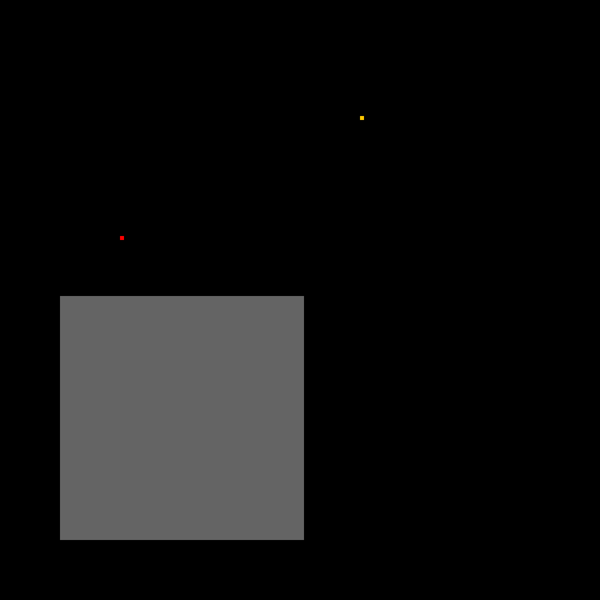
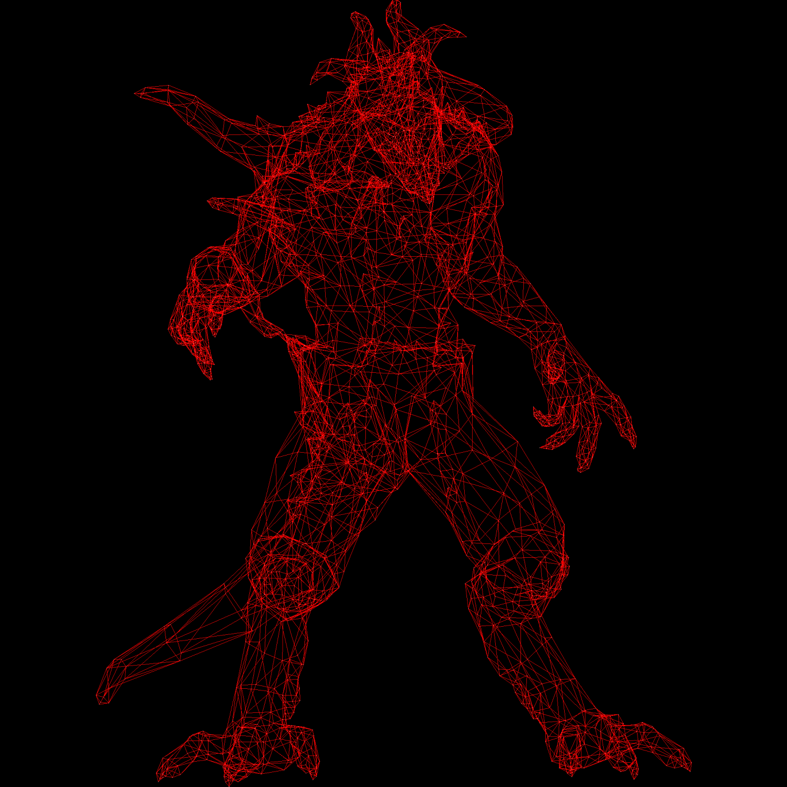
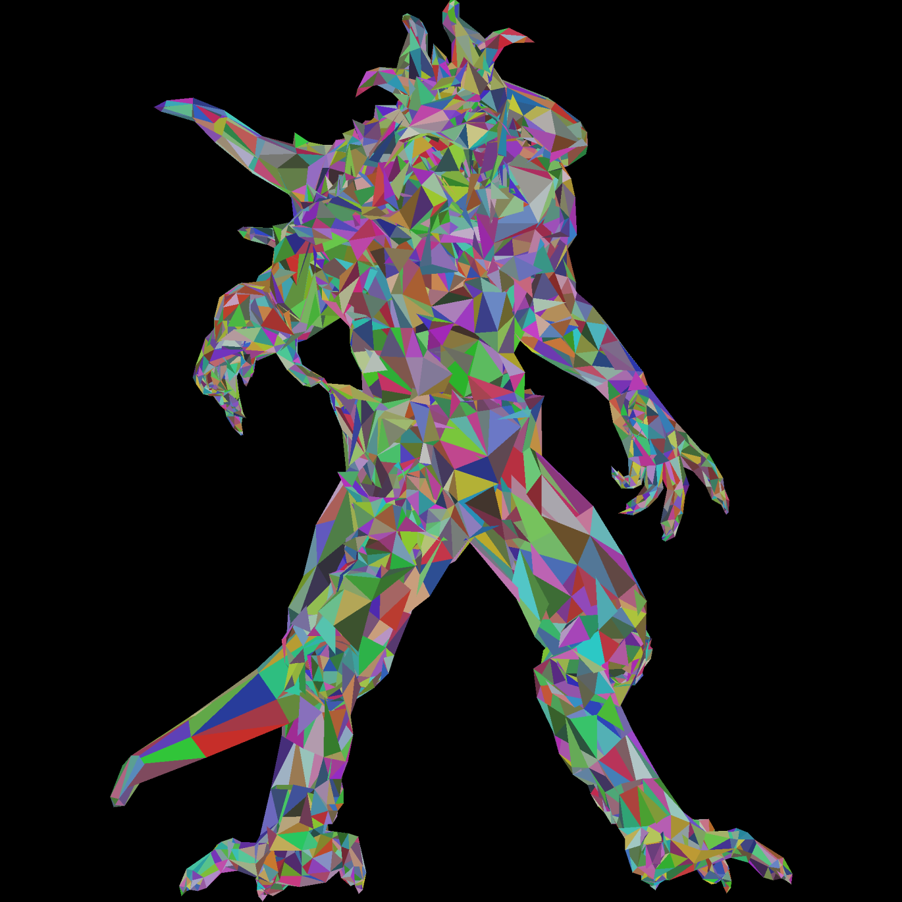
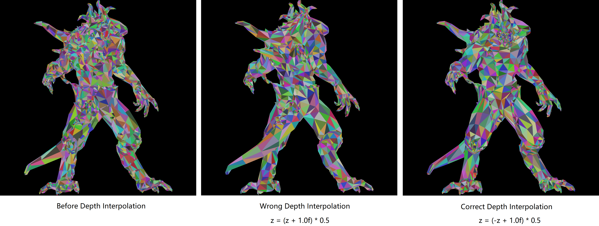
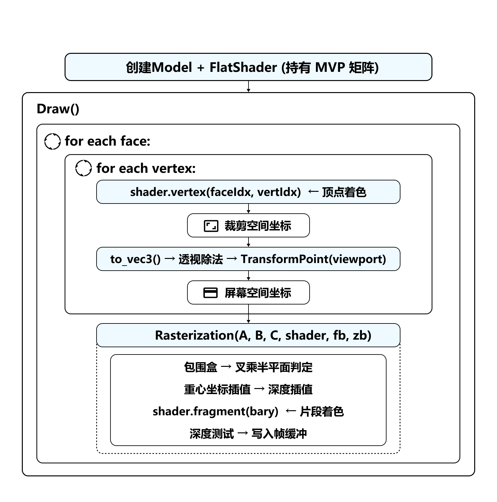

# 项目构建日志

## Day1 - 项目启动与 TGA 图像处理类

本项目以 [ssloy/tinyrenderer](https://github.com/ssloy/tinyrenderer) 为参考，从零开始实现一个最小 CPU Renderer。与直接调用 OpenGL / DirectX 不同，CPU Renderer 的重点在于亲自实现图形渲染管线中的关键步骤，包括：图像缓冲区、直线绘制、三角形绘制、模型读取、视口变换、深度测试、光照与纹理映射等。

推荐在 WSL 环境下构建与运行。进入项目文件夹后，可以使用如下命令进行原项目测试：

```bash
cmake -B build &&
cmake --build build -j &&
build/tinyrenderer obj/diablo3_pose/diablo3_pose.obj obj/floor.obj
```

生成的文件 `framebuffer.tga` 位于项目同级目录中。

---

### 1. TGA 图像处理类

根据教程建议，项目初期直接复用 `tgaimage.cpp` 与 `tgaimage.h`。本 CPU Renderer 的核心并不在图像格式解析本身，因此 Day1 阶段只对其关键接口进行理解和验证。

当前主要使用到的接口如下：

1. 使用 `TGAColor` 定义颜色。

   > 注意：`TGAColor` 中的颜色通道顺序为 **BGRA**，而不是常见的 RGBA。写颜色时需要特别留意通道顺序。

2. 实例化 `TGAImage` 对象作为 framebuffer。

3. 调用 `image.set(x, y, color)` 设置指定像素颜色。

4. 调用 `image.write_tga_file(filename)` 输出最终的 `.tga` 图像文件。

示例：

```cpp
const int width = 1000;
const int height = 1000;

TGAImage image(width, height, TGAImage::RGB);
TGAColor red = {0, 0, 255, 255}; // BGRA order

image.set(100, 100, red);
image.write_tga_file("framebuffer.tga");
```

---

### 2. 构建最小可运行 CMake 项目

初始 `CMakeLists.txt` 可写成：

```cmake
cmake_minimum_required(VERSION 3.16)

project(MyTinyRenderer LANGUAGES CXX)

set(CMAKE_CXX_STANDARD 17)
set(CMAKE_CXX_STANDARD_REQUIRED ON)

add_executable(MyTinyRenderer
    main.cpp
    tgaimage.cpp
)
```

在终端中构建并运行：

```bash
cmake -B build
cmake --build build
./build/MyTinyRenderer
```

如果只修改 `.cpp` 源文件，通常只需要重新执行：

```bash
cmake --build build
./build/MyTinyRenderer
```

如果修改了 `CMakeLists.txt`，则建议重新 configure：

```bash
cmake -B build
cmake --build build
./build/MyTinyRenderer
```

---

### 3. 图像坐标系验证

为了确认 `TGAImage::set(x, y, color)` 的坐标定义，我在图像中手动绘制了几个测试像素点。

<div align="center">
  
</div>

根据测试图像可以确认：

- `TGAImage` 使用的坐标原点位于图像左下角，即 `(0, 0)`；
- 横坐标范围为 `[0, width - 1]`；
- 纵坐标范围为 `[0, height - 1]`。

这一步非常关键，因为后续所有从模型坐标到屏幕坐标的映射，都需要建立在正确的图像坐标系理解之上。


## Day2 - 直线绘制、OBJ 模型读取与线框渲染

Day2 的目标是完成从“单个像素绘制”到“模型线框渲染”的跨越。最终实现流程如下：

```text
读取 OBJ 模型
↓
解析顶点 v 与面 f
↓
将模型坐标变换到屏幕坐标
↓
根据 face index 取出三角形三个顶点
↓
调用 TriangleDraw 绘制模型线框
↓
输出 framebuffer.tga
```

---

### 1. Bresenham 直线绘制算法

Bresenham’s line drawing algorithm 用于在离散像素网格上绘制一条尽量接近理想连续直线的线段。

> 该算法的优势在于主要使用整数运算，避免浮点数计算带来的额外开销，因此非常适合底层图形绘制。

为了便于理解，先讨论斜率满足 `0 < m < 1` 的情况。假设当前已经绘制到像素：

$$
(x_k, y_k)
$$

那么下一个像素只可能有两种选择：

$$
E =(x_k+1, y_k)
$$

或：

$$
NE =(x_k+1, y_k+1)
$$

因此，算法的核心问题可以转化为：真实直线更接近 `E`，还是更接近 `NE`。

我们考察两个候选像素之间的中点：

$$
M =(x_k+1, y_k+\frac{1}{2})
$$

若真实直线在中点上方，则选择 `NE`；若真实直线在中点下方，则选择 `E`。

| 真实直线位置 | 说明             | 选择 |
| ------------ | ---------------- | ---- |
| 在中点上方   | 更接近上面的像素 | NE   |
| 在中点下方   | 更接近下面的像素 | E    |

对应的判断参数更新规则为：

| 判断条件      | 选择像素             | 更新公式                 |
| ------------- | -------------------- | ------------------------ |
| $p_k < 0$     | $(x_k+1, y_k)$       | $p_{k+1}=p_k+2dy$        |
| $p_k \geq 0$ | $(x_k+1, y_k+1)$     | $p_{k+1}=p_k+2dy-2dx$    |

在实现层面，需要进一步处理以下情况：

- 斜率绝对值大于 1 的直线；
- 从右向左绘制的直线；
- 水平线与垂直线；
- 坐标差为负数的情况。

这些问题可以通过坐标交换、端点交换和统一增量方向来处理。

### 2. 三角形框线绘制

有了直线绘制函数后，可以进一步封装三角形线框绘制函数。核心逻辑非常直接：一个三角形由三个顶点组成，只需要连接三条边。

```cpp
void TriangleDraw(
    const point3f& p0,
    const point3f& p1,
    const point3f& p2,
    TGAImage& image,
    const TGAColor& color
) {
    LineDraw(p0.x, p0.y, p1.x, p1.y, image, color);
    LineDraw(p1.x, p1.y, p2.x, p2.y, image, color);
    LineDraw(p2.x, p2.y, p0.x, p0.y, image, color);
}
```

这一阶段的 `TriangleDraw` 仍然只是线框绘制，还没有真正进行三角形内部填充。后续将进一步扩展为 triangle rasterization。

---

### 3. 基础向量类型：`vec3i` 与 `point3f`

为了表达三维顶点、颜色、方向和索引，项目中实现了一个轻量级三维向量模板。

```cpp
template<typename T>
struct vec3 {
    T x, y, z;

    vec3() : x(0), y(0), z(0) {}
    vec3(T x, T y, T z) : x(x), y(y), z(z) {}
};
```

随后通过类型别名标定不同语义：

```cpp
using vec3i = vec3<int>;
using vec3f = vec3<float>;
using point3f = vec3<float>;
```

虽然 `vec3f` 和 `point3f` 底层都是 `vec3<float>`，但语义上有所区别：

| 类型      | 语义                 | 示例用途                 |
| --------- | -------------------- | ------------------------ |
| `vec3i`   | 三个整数索引         | face 中的顶点索引        |
| `vec3f`   | 三维向量             | 法线、方向、颜色等       |
| `point3f` | 三维空间中的点       | 模型顶点坐标             |

在 CPU Renderer 中，这类数学基础类型非常重要。后续无论是三角形插值、法线计算、光照方向，还是纹理坐标处理，都会建立在这些基础类型之上。

---

### 4. Wavefront OBJ 文件格式阅读

模型数据被存储在 `.obj` 文件中。当前阶段主要关注两类行：

#### 4.1 顶点数据：`v`

以 `v` 开头的行定义三维空间中的顶点位置。每行包含三个数字，分别表示顶点的 `x`、`y`、`z` 坐标。

例如：

```obj
v 0.608654 -0.568839 -0.416318
```

表示模型中存在一个坐标为：

$$
(0.608654, -0.568839, -0.416318)
$$

的顶点。

在代码中，可以将所有 `v` 行顺序读取，并存入：

```cpp
std::vector<point3f> vertices_;
```

读取关键语句如下：

```cpp
if (prefix == "v") {
    float x, y, z;
    iss >> x >> y >> z;
    vertices_.push_back(point3f(x, y, z));
}
```

#### 4.2 面数据：`f`

以 `f` 开头的行定义模型表面的一个面。对于当前的三角网格模型，每个 `f` 行通常包含三个顶点描述。

例如：

```obj
f 1193/1240/1193 1180/1227/1180 1179/1226/1179
```

其中每个顶点描述的标准格式为：

```text
vertex index / texture coordinate index / normal index
```

即：

```text
顶点索引 / 纹理坐标索引 / 法线索引
```

需要注意的是，OBJ 文件中的索引从 **1** 开始，而 C++ `vector` 的下标从 **0** 开始。因此读取索引后必须减一。

---

### 5. `fragment`：面数据结构设计

当前阶段可以将一个三角形面抽象为一个 `fragment` 结构体。严格来说，这个结构表示的是 OBJ 中的一个 face，而不是光栅化之后的 fragment；这里沿用项目中的命名。它包含三组索引：

```cpp
struct fragment {
    vec3i v_idx;   // 三个顶点位置索引
    vec3i vt_idx;  // 三个纹理坐标索引
    vec3i vn_idx;  // 三个法线索引
};
```

例如某个 OBJ 面为：

```obj
f 1193/1240/1193 1180/1227/1180 1179/1226/1179
```

那么解析后可以得到：

```cpp
face.v_idx  = vec3i(1192, 1179, 1178);
face.vt_idx = vec3i(1239, 1226, 1225);
face.vn_idx = vec3i(1192, 1179, 1178);
```

其中每个数字都已经完成了 `-1` 处理，能够直接作为 C++ `vector` 下标使用。

---

### 6. `Model` 类：OBJ Loader 与模型数据封装

最初可以将类命名为 `TinyObjLoader`，但随着项目推进，它不只是一个“加载器”，而是加载后承载了模型本身的数据。因此命名为 `Model` 更自然。

`Model` 类的基本职责包括：

- 读取 `.obj` 文件；

- 保存所有顶点坐标；

- 保存所有三角面索引；

- 对外提供 `vertices()` 和 `faces()` 接口。

  > 头文件设计可直接查看 `tinyobjloader.h`，这里重点记录类的职责与使用方式。

为了让使用方式更加简洁，可以将模型读取放入构造函数：

```cpp
Model::Model(const std::string& filename) {
    load(filename);
}
```

这样主程序中就可以直接写：

```cpp
Model model("diablo3_pose.obj");
```

相比：

```cpp
Model model;
model.load("diablo3_pose.obj");
```

构造函数形式更加符合“创建对象时即完成初始化”的直觉。

---

### 7. 解析 `f` 行中的顶点描述

OBJ 的 `f` 行并不是简单的整数序列，而是形如：

```obj
f 1/2/3 4/5/6 7/8/9
```

其中每一个 `1/2/3` 都表示一个顶点描述。为了复用解析逻辑，可以写一个小函数，将字符串解析为 `vec3i`。

```cpp
auto parseFaceVertex = [](const std::string& s) {
    vec3i idx(-1, -1, -1);

    std::stringstream ss(s);
    std::string item;

    int part = 0;

    while (std::getline(ss, item, '/')) {
        if (!item.empty()) {
            int value = std::stoi(item) - 1;

            if (part == 0) idx.x = value;      // vertex index
            else if (part == 1) idx.y = value; // texture index
            else if (part == 2) idx.z = value; // normal index
        }

        part++;
    }

    return idx;
};
```

该函数的作用是将：

```text
"1/2/3"
```

解析为：

```cpp
vec3i(0, 1, 2)
```

这里减一的原因是 OBJ 索引从 1 开始，而 C++ 下标从 0 开始。

该函数也可以兼容部分 OBJ 格式变体：

| OBJ 写法 | 含义                   | 解析结果示例      |
| -------- | ---------------------- | ----------------- |
| `1`      | 只有顶点索引           | `(0, -1, -1)`     |
| `1/2/3`  | 顶点 / 纹理 / 法线     | `(0, 1, 2)`       |
| `1//3`   | 顶点 / 无纹理 / 法线   | `(0, -1, 2)`      |

随后对一整行 `f` 进行解析：

```cpp
else if (prefix == "f") {
    fragment face;

    std::string s0, s1, s2;
    iss >> s0 >> s1 >> s2;

    vec3i a = parseFaceVertex(s0);
    vec3i b = parseFaceVertex(s1);
    vec3i c = parseFaceVertex(s2);

    face.v_idx  = vec3i(a.x, b.x, c.x);
    face.vt_idx = vec3i(a.y, b.y, c.y);
    face.vn_idx = vec3i(a.z, b.z, c.z);

    faces_.push_back(face);
}
```

这里需要注意一个结构转换：

- `a = vec3i(v0, vt0, vn0)` 表示第一个角点的三类索引；
- `b = vec3i(v1, vt1, vn1)` 表示第二个角点的三类索引；
- `c = vec3i(v2, vt2, vn2)` 表示第三个角点的三类索引。

而最终 `fragment` 中更适合按索引类型组织：

```cpp
face.v_idx  = vec3i(v0, v1, v2);
face.vt_idx = vec3i(vt0, vt1, vt2);
face.vn_idx = vec3i(vn0, vn1, vn2);
```

这样后续渲染时，可以直接通过 `face.v_idx` 取出三角形的三个空间顶点。

---

### 8. CMake 自动收集源文件

在新增 `model.cpp` 后，曾遇到链接错误：

```bash
undefined reference to `Model::load(std::string const&)'
```

该错误的原因不是 `Model::load()` 逻辑错误，而是 `model.cpp` 没有被加入 `add_executable`，导致编译器看到了函数声明，但链接器找不到函数定义。

最直接的修复方式是在 `CMakeLists.txt` 中手动添加：

```cmake
add_executable(MyTinyRenderer
    main.cpp
    tgaimage.cpp
    linedraw.cpp
    model.cpp
)
```

但随着项目文件变多，手动维护源文件列表比较繁琐。因此可以改为递归收集 `.cpp` 文件：

```cmake
cmake_minimum_required(VERSION 3.16)

project(MyTinyRenderer LANGUAGES CXX)

set(CMAKE_CXX_STANDARD 17)
set(CMAKE_CXX_STANDARD_REQUIRED ON)

file(GLOB_RECURSE SOURCES CONFIGURE_DEPENDS
    "${CMAKE_CURRENT_SOURCE_DIR}/*.cpp"
)

list(FILTER SOURCES EXCLUDE REGEX "${CMAKE_CURRENT_SOURCE_DIR}/build/.*")

add_executable(MyTinyRenderer
    ${SOURCES}
)
```

其中：

- `GLOB_RECURSE` 用于递归搜索所有 `.cpp` 文件；
- `CONFIGURE_DEPENDS` 使 CMake 在新增源文件后尽量自动重新扫描；
- `list(FILTER ...)` 用于避免把 `build/` 目录中的临时文件错误加入工程。

> 注：`file(GLOB_RECURSE)` 适合学习项目快速迭代；更规范的大型工程通常仍会显式列出源文件，便于代码审查和构建系统追踪。

---

### 9. 模型坐标到屏幕坐标：视口变换

OBJ 文件中的顶点通常位于模型坐标空间中。当前模型的坐标大致处于 `[-1, 1]` 范围内，因此可以先使用一个简单的视口变换，将其映射到图像像素坐标：

```cpp
std::vector<point3f> vertices = model.vertices();

for (auto& ver : vertices) {
    ver.x = (ver.x + 1.0f) * (width  - 1) / 2.0f;
    ver.y = (ver.y + 1.0f) * (height - 1) / 2.0f;
}
```

这里没有直接使用 `width / 2.0f`，而是使用 `(width - 1) / 2.0f`，原因是图像坐标的最大合法下标为 `width - 1`，而不是 `width`。

也就是说：

```text
模型坐标 x = -1  →  屏幕坐标 x = 0
模型坐标 x =  1  →  屏幕坐标 x = width - 1
```

这一步目前只是最简单的 viewport transform。后续会在此基础上继续引入模型变换、观察变换、投影变换等完整 MVP 流程。

---

### 10. 根据 face index 绘制模型线框

读取模型后，绘制线框的核心逻辑如下：

```cpp
Model model("diablo3_pose.obj");

std::vector<point3f> vertices = model.vertices();

for (auto& ver : vertices) {
    ver.x = (ver.x + 1.0f) * (width  - 1) / 2.0f;
    ver.y = (ver.y + 1.0f) * (height - 1) / 2.0f;
}

for (const auto& frag : model.faces()) {
    const vec3i& face = frag.v_idx;

    TriangleDraw(
        vertices[face.x],
        vertices[face.y],
        vertices[face.z],
        image,
        red
    );
}

image.write_tga_file("imagetest_framebuffer.tga");
```

这里需要特别注意：不要将循环中的 `face` 声明为 `static`。

错误写法：

```cpp
for (const auto& frag : model.faces()) {
    static vec3i face = frag.v_idx;
    TriangleDraw(vertices[face.x], vertices[face.y], vertices[face.z], image, red);
}
```

`static` 局部变量只会在第一次进入函数或代码块时初始化一次。因此，如果在循环中写成 `static vec3i face = frag.v_idx;`，它会一直保存第一张面的索引，导致程序重复绘制同一个三角形。

正确写法：

```cpp
for (const auto& frag : model.faces()) {
    const vec3i& face = frag.v_idx;
    TriangleDraw(vertices[face.x], vertices[face.y], vertices[face.z], image, red);
}
```

---

### 11. 当前渲染结果

最终成功输出了 Diablo 模型的线框图：

<div align="center">
  
</div>


从结果可以确认：

- 顶点读取正确，模型比例没有明显变形；
- `f` 行索引解析正确，三角网格连接关系没有错乱；
- OBJ 索引到 C++ 下标的 `-1` 处理正确；
- 视口变换能够将模型坐标映射到图像空间；
- 所有三角面都被遍历并绘制出来。

这意味着当前已经打通了 CPU Renderer 的第一条完整数据链路：

```text
OBJ 文件 → 顶点数组 → 面索引数组 → 屏幕坐标 → 线框图像输出
```


## Day3 - 三角形光栅化与随机颜色填充

Day2 已经能够将模型的三角形以线框形式绘制到屏幕上，但三维渲染的最终目标是为三角形内部填充正确的颜色，形成连续的实体表面。Day3 的核心任务是实现三角形光栅化（Triangle Rasterization）。这一阶段先完成「点是否落在三角形内部」的判定与填色；背面剔除可以建立在同一套叉乘符号判断之上，但需要额外指定只接受某一种顶点缠绕方向。

---

### 1. 光栅化的核心问题

光栅化的本质是回答一个几何判定问题：

> 给定一个三角形和屏幕上的一个像素点，该像素是否位于三角形内部？

如果答案是肯定的，那么该像素应被着色；否则，该像素保持不变。因此，三角形的光栅化可以被分解为：

1. 确定三角形的屏幕空间包围盒（Bounding Box）；
2. 遍历包围盒中的每个像素；
3. 对每个像素执行「点在三角形内」的判定；
4. 为内部像素填充指定颜色。

---

### 2. 利用二维叉乘判断点是否在三角形内部

判定点在三角形内部的方法有多种，本项目采用 **向量叉乘符号法**。其核心原理基于二维向量的叉乘：

$$
\text{cross}(\vec{a}, \vec{b}) = a_x b_y - a_y b_x
$$

设三角形三个顶点为 $A$、$B$、$C$（屏幕空间坐标），当前待检测像素点为 $P$。构造三个边向量与指向 $P$ 的向量，求叉乘：

$$
\begin{aligned}
w_0 &= \text{cross}(\vec{AB}, \vec{AP}) \\
w_1 &= \text{cross}(\vec{BC}, \vec{BP}) \\
w_2 &= \text{cross}(\vec{CA}, \vec{CP})
\end{aligned}
$$

若 $P$ 在三角形内部，则 $w_0$、$w_1$、$w_2$ 必然 **同号**（全 ≥0 或全 ≤0，取决于顶点缠绕顺序）。

实际实现中，`geometry.h` 已提供了 `cross` 函数用于二维向量的叉乘：

```cpp
template <typename T>
T cross(const vec2<T>& a, const vec2<T>& b) {
    return a.x * b.y - a.y * b.x;
}
```

因此光栅化核心判定逻辑可写为：

```cpp
for (int x = x_min; x <= x_max; x++) {
    for (int y = y_min; y <= y_max; y++) {
        vec2 p(x, y);
        float w0 = cross(b - a, p - a);
        float w1 = cross(c - b, p - b);
        float w2 = cross(a - c, p - c);

        if ((w0 >= 0 && w1 >= 0 && w2 >= 0) ||
            (w0 <= 0 && w1 <= 0 && w2 <= 0)) {
            framebuffer.set(x, y, color);
        }
    }
}
```

| 条件                                    | 含义                                                         |
| --------------------------------------- | ------------------------------------------------------------ |
| $w_0, w_1, w_2$ 全部 ≥ 0               | 在屏幕坐标 $y$ 向上、顶点为逆时针（CCW）时，$P$ 在三角形内部 |
| $w_0, w_1, w_2$ 全部 ≤ 0               | 在屏幕坐标 $y$ 向上、顶点为顺时针（CW）时，$P$ 在三角形内部  |
| 三个值出现异号                          | $P$ 在三角形外部，该像素不填充                               |

需要注意：**同号判定本身并不等价于背面剔除**。上面的写法同时接受「全 ≥ 0」和「全 ≤ 0」，因此会绘制三角形的两种缠绕方向，本质上是双面绘制。若要做真正的背面剔除，应当只接受其中一种符号，例如只保留逆时针三角形：

```cpp
if (w0 >= 0 && w1 >= 0 && w2 >= 0) {
    framebuffer.set(x, y, color);
}
```

或者在进入光栅化前先计算三角形屏幕空间有向面积，根据面积正负跳过背向面。

---

### 3. 包围盒优化

遍历整个图像的所有像素来做三角形判定是巨大的浪费——绝大多数像素不靠近目标三角形。光栅化的第一步应该先计算三角形在屏幕空间的最小轴对齐包围盒（Axis-Aligned Bounding Box, AABB）：

```cpp
int x_min = std::min(std::min(ax, bx), cx);
int y_min = std::min(std::min(ay, by), cy);
int x_max = std::max(std::max(ax, bx), cx);
int y_max = std::max(std::max(ay, by), cy);
```

同时，必须将包围盒裁剪（clamp）到帧缓冲的合法坐标范围，防止写入图像越界崩溃：

```cpp
x_min = std::max(0, x_min);
y_min = std::max(0, y_min);
x_max = std::min(framebuffer.width() - 1, x_max);
y_max = std::min(framebuffer.height() - 1, y_max);
```

---

### 4. 随机颜色填充

为了直观地区分模型上不同的三角形面，Day3 为每个三角面生成一个随机颜色进行填充。利用 `<random>` 标准库中的 Mersenne Twister 引擎：

```cpp
static std::mt19937 rng(std::random_device{}());
static std::uniform_int_distribution<int> dist(40, 200);

fillcolor = {
    static_cast<unsigned char>(dist(rng)), // B
    static_cast<unsigned char>(dist(rng)), // G
    static_cast<unsigned char>(dist(rng)), // R
    255                                    // A
};
```

使用 `static` 修饰函数内的局部随机数生成器，可以避免每次进入循环都重新构造一个新的引擎对象。由于 `std::random_device` 的构造和初始化有一定开销，`static` 使引擎在程序的整个生命周期内只初始化一次，从而使随机数序列的连续性和分布均匀性得到保证。

---

### 5. 重构：从单一绘制到 `DrawWireFrame` 与 `DrawFillFrame` 分离

为了避免功能混淆，将线框绘制与填充绘制拆分为两个独立接口：

| 函数              | 职责                                                 |
| ----------------- | -------------------------------------------------- |
| `DrawWireFrame`   | 仅绘制三角形的三条边 + 顶点标记点                     |
| `DrawFillFrame`   | 遍历所有面，对每个三角形执行 `Rasterization` 填充     |

另外，底层的 `TriangleDraw` 只负责绘制三条边（线框），真正的填充逻辑由 `Rasterization` 单独完成。这种分离设计使得后续可以在同一个三角形上同时绘制填充面和边框线，灵活性更高。

---

### 6. 渲染结果

经过 Day3 的实现，项目能够输出带有随机颜色填充的模型渲染图像。每个三角形面被赋予一个随机颜色，可以清晰地分辨模型的三角网格结构。这表明手动实现的 CPU 光栅化管线已经正确地完成了从三维顶点到二维填充面的完整转换：

```text
OBJ 文件 → 顶点数组 → 面索引数组 → 屏幕坐标 → 包围盒计算 → 叉乘判定 → 像素填充 → 图像输出
```

当前渲染器已具备的能力：
- 像素级颜色写入
- 线段光栅化（Bresenham）
- OBJ 模型读取与解析
- 视口变换
- 三角形光栅化（基于叉乘的半平面判定）
- 点在三角形内判定（基于叉乘符号 / edge function）
- 随机颜色填充

<div align="center">
  
</div>

## Day4 - 重心插值与深度缓冲

Day3 已经能用随机颜色填充每个三角面，但所有三角形之间没有任何前后遮挡关系——后绘制的面总是覆盖先绘制的面。Day4 的任务是引入深度缓冲（Z-Buffer）实现正确的隐藏面消除，并用重心坐标插值让每个像素拥有平滑的深度值。

---

### 1. 重心坐标：用面积比定位三角形内的任意点

已知三角形三个顶点 $A, B, C$，对于三角形内部的任意一点 $P$，存在一组唯一常数 $(\alpha, \beta, \gamma)$ 使得：

$$
P = \alpha A + \beta B + \gamma C, \quad \alpha + \beta + \gamma = 1, \quad \alpha, \beta, \gamma \geq 0
$$

这三个值称为重心坐标（Barycentric Coordinates）。直观理解：$\alpha$ 越大，$P$ 越靠近 $A$；$\beta$ 越大，$P$ 越靠近 $B$，以此类推。

重心坐标可以通过子三角形面积比来计算：

$$
\alpha = \frac{\text{Area}(P, B, C)}{\text{Area}(A, B, C)}, \quad
\beta  = \frac{\text{Area}(A, P, C)}{\text{Area}(A, B, C)}, \quad
\gamma = 1 - \alpha - \beta
$$


三角形面积使用鞋带公式（Shoelace Formula）——本质上是二维向量叉乘：

```cpp
float triangle_area(vec2f A, vec2f B, vec2f C) {
    return std::abs(0.5f * (A.x * (B.y - C.y) + B.x * (C.y - A.y) + C.x * (A.y - B.y)));
}
```

由于光栅化阶段已经通过叉乘判定 $P$ 在三角形内部，这里直接取面积的绝对值即可。

---

### 2. 精度修复：从 `vec2i` 迁移到 `vec2f`

Day3 的光栅化过程中，顶点坐标被截断为整数后参与叉乘判定和面积计算。这在正交投影下简单可工作，但存在问题：

- 视口变换后的顶点坐标是 `float`，截断为 `int` 丢失了亚像素精度；
- `triangle_area(vec2i)` 计算出的重心坐标不够精确，直接影响后续深度插值的正确性。

Day4 将光栅化流程中的关键类型从 `vec2i` 改为 `vec2f`：

| 位置                | Day3（旧）          | Day4（新）           |
| ------------------- | ------------------- | -------------------- |
| 顶点坐标            | `int ax, ay`        | `float ax, ay`       |
| 点向量类型          | `vec2i`             | `vec2f`              |
| 遍历像素坐标        | `vec2i p(x, y)`     | `vec2f p(x+0.5, y+0.5)` 或 `vec2f p(x, y)` |
| 面积计算类型        | `vec2i`             | `vec2f`              |

这样重心坐标的插值恢复到了浮点数精度，深度插值结果才能准确反映像素的真实深度。

---

### 3. 深度缓冲（Z-Buffer）：解决遮挡问题

多三角形在屏幕上重叠时，正确的渲染结果应当让离相机更近的像素覆盖更远的像素。Z-Buffer 是解决这一问题的经典方案：

- 维护一张与屏幕分辨率相同的二维浮点数缓冲区，所有值初始化为最大深度（1.0f）；
- 在光栅化时，对每个三角形内部像素，通过重心坐标插值出该像素的深度值；
- 只有新深度小于 Z-Buffer 中已记录深度的像素才会被绘制，并同时更新 Z-Buffer。

类型定义（置于 `geometry.h`，紧邻各类型别名）：

```cpp
using z_buffer = std::vector<std::vector<float>>;
```

Z-Buffer 初始化（位于 `main.cpp`）：

```cpp
z_buffer zbuffer(width, std::vector<float>(height, 1.0f));
```

在 `Rasterization` 中实现深度测试：

```cpp
float depth = alpha * az + beta * bz + gamma * cz;
if (depth < zbuffer[x][y]) {
    framebuffer.set(x, y, color);
    zbuffer[x][y] = depth;
}
```

$(\alpha, \beta, \gamma)$ 是像素 $P$ 的重心坐标，$(a_z, b_z, c_z)$ 是三角形三个顶点的深度。`depth < zbuffer[x][y]` 意味着当前像素比 Z-Buffer 中已有的像素离相机更近，因此覆盖并更新。

---

### 4. 深度视口变换：近小远大

OBJ 文件中的顶点 Z 坐标大致在 $[-1, 1]$ 范围内。由于 Day4 还没有引入 View / Projection，而是直接在模型坐标基础上做屏幕映射，因此需要先临时约定一个深度方向来适配 Z-Buffer 的 $[0,1]$ 区间。

在当前简化管线中，约定 **Z 值越大表示离相机越近**，所以实际映射关系为「近小远大：取反后再归一到 [0,1]」：

```cpp
ver.z = (-ver.z + 1.0f) * 0.5f;
```

这个变换确保：
- 离相机近的大 Z 值 → 映射为靠近 0 的小深度值 → 在 Z-Buffer 比较中胜出；
- 离相机远的小 Z 值 → 映射为靠近 1 的大深度值 → 被更近的像素遮挡。

> 这是一个容易踩坑的点。如果写成 `(ver.z + 1.0) * 0.5`（不取反），近处的面反而会被远处的面遮挡，渲染结果是反的。

---

### 5. 接口重构

配合 Z-Buffer 的引入，同步清理了函数签名中未使用的参数：

| 函数              | 变更                                                    |
| ----------------- | ------------------------------------------------------- |
| `TriangleDraw`    | 移除未使用的 `fillcolor` 参数                              |
| `Rasterization`   | 移除未使用的 `width`/`height`；新增 `z_buffer&`；顶点类型从 `int/vec2i` 改为 `float/vec2f` |
| `DrawFillFrame`   | 新增 `z_buffer&`；坐标系新增 Z 深度视口变换                |

---

### 6. 渲染结果

加入深度缓冲后，不同三角形之间有了正确的遮挡关系——近处的面遮挡远处的面，模型呈现出完整且前后关系正确的实体表面：

<div align="center">
  
</div>


---

### 7. 当前管线总览

```text
OBJ 文件 → 顶点数组 → 面索引数组
         → 视口变换 (x, y, z) → 包围盒计算
         → 叉乘半平面判定 → 重心坐标插值
         → 深度测试 (Z-Buffer) → 像素填充 → 图像输出
```

Day4 完成后，渲染器从「所有面平铺重叠」进化为「正确的前后遮挡」。下一步将引入真正使画面产生立体感的关键技术：**明暗着色（Flat Shading / Gouraud Shading）与光照计算**。

## Day5 - 相机模型与 MVP 变换

图形学经典坐标变换问题：点坐标经过矩阵乘法，变换坐标基，从局部空间逐步变换至屏幕坐标。Day5 实现完整的 MVP（Model-View-Projection）变换管线。

---

### 1. 变换管道总览

一个三维顶点从模型文件到屏幕像素，需要经历四个坐标空间的变换：

```text
局部空间 ----- [Model] → 世界空间 ----- [View] → 观察空间 ----- [Perspective] → 裁剪空间 ----- [÷w] → NDC ----- [Viewport] → 屏幕空间
```

| 阶段 | 矩阵 | 作用 |
| ---- | ---- | ---- |
| Model | `Rotate` / `Scale` / `Translate` | 将物体从自身局部坐标系放置到世界场景中 |
| View | `LookAt` | 以摄像机为原点重新表达整个场景 |
| Perspective | `Perspective` | 透视变形，输出裁剪空间坐标，随后需要执行透视除法 |
| Viewport | `Viewport` | 将 NDC 坐标映射到屏幕像素坐标 |

---

### 2. 齐次坐标：为什么需要 4×4 矩阵

一个核心问题：在三维空间中，**平移** 无法用 3×3 矩阵的线性变换表示。

$$
\begin{bmatrix} x' \\ y' \\ z' \end{bmatrix} =
\begin{bmatrix} a & b & c \\ d & e & f \\ g & h & i \end{bmatrix}
\begin{bmatrix} x \\ y \\ z \end{bmatrix}
$$

无论 $a$ 到 $i$ 如何取值，$(0,0,0)$ 永远只能映射到 $(0,0,0)$，无法表达「将原点移动到 $(t_x, t_y, t_z)$」的平移操作。

**齐次坐标的解决方案**：将三维点 $(x,y,z)$ 嵌入四维空间，表示为 $(x, y, z, 1)$。多出来的第四维使得平移可以写进矩阵的第四列：

$$
\begin{bmatrix} 1 & 0 & 0 & t_x \\ 0 & 1 & 0 & t_y \\ 0 & 0 & 1 & t_z \\ 0 & 0 & 0 & 1 \end{bmatrix}
\begin{bmatrix} x \\ y \\ z \\ 1 \end{bmatrix} =
\begin{bmatrix} x + t_x \\ y + t_y \\ z + t_z \\ 1 \end{bmatrix}
$$

更一般地，齐次坐标 $(wx, wy, wz, w)$（$w \neq 0$）与笛卡尔坐标 $(x, y, z)$ 等价。从齐次坐标恢复笛卡尔坐标只需 **除以 $w$**——这是后续透视投影中「透视除法」的基础。

---

### 3. Model 变换：旋转、缩放、平移

Model 变换将物体从局部坐标系放置到世界坐标系。三种基本操作对应三类矩阵。

#### 3.1 平移矩阵

$$
T(t_x, t_y, t_z) = \begin{bmatrix}
1 & 0 & 0 & t_x \\
0 & 1 & 0 & t_y \\
0 & 0 & 1 & t_z \\
0 & 0 & 0 & 1
\end{bmatrix}
$$

> 验证：$T \cdot (x,y,z,1)^\top = (x+t_x, y+t_y, z+t_z, 1)^\top$，符合平移定义。

代码对应（`transformation.cpp:11-17`）：

```cpp
mat4f Translate(float tx, float ty, float tz) {
    return mat4f{
        1, 0, 0, tx,
        0, 1, 0, ty,
        0, 0, 1, tz,
        0, 0, 0, 1
    };
}
```

> 矩阵的 `mat4f{m00, m01, m02, m03, m10, ...}` 构造语法按**行优先**书写，但内存布局与数学上的 $M_{ij}$ 一致。**矩阵乘向量时使用列向量**：`M * v` 表示 $M \cdot \vec{v}$。

#### 3.2 缩放矩阵

$$
S(s_x, s_y, s_z) = \begin{bmatrix}
s_x & 0 & 0 & 0 \\
0 & s_y & 0 & 0 \\
0 & 0 & s_z & 0 \\
0 & 0 & 0 & 1
\end{bmatrix}
$$

> 将 $s_x, s_y, s_z$ 放在对角线上即可按轴缩放。$s_x = s_y = s_z$ 时为均匀缩放。

代码对应（`transformation.cpp:25-32`）：

```cpp
mat4f Scale(float sx, float sy, float sz) {
    return mat4f{
        sx, 0,  0,  0,
        0,  sy, 0,  0,
        0,  0,  sz, 0,
        0,  0,  0,  1
    };
}
```

#### 3.3 旋转矩阵

旋转矩阵的本质是 **基变换**：将标准正交基 $\hat{i}, \hat{j}, \hat{k}$ 分别旋转到新方向，新方向的坐标分别构成矩阵的三个列向量。

以 **绕 Z 轴旋转 $\theta$** 为例：

| 原基向量 | 旋转后的坐标 | 作为矩阵的哪一列 |
| -------- | ------------ | ---------------- |
| $\hat{i} = (1, 0, 0)$ | $(\cos\theta, \sin\theta, 0)$ | 第 0 列 |
| $\hat{j} = (0, 1, 0)$ | $(-\sin\theta, \cos\theta, 0)$ | 第 1 列 |
| $\hat{k} = (0, 0, 1)$ | $(0, 0, 1)$ | 第 2 列 |

因此：

$$
R_z(\theta) = \begin{bmatrix}
\cos\theta & -\sin\theta & 0 & 0 \\
\sin\theta &  \cos\theta & 0 & 0 \\
0          &  0          & 1 & 0 \\
0          &  0          & 0 & 1
\end{bmatrix}
$$

同理可得绕 X 轴和绕 Y 轴的旋转矩阵：

$$
R_x(\theta) = \begin{bmatrix}
1 & 0          & 0           & 0 \\
0 & \cos\theta & -\sin\theta & 0 \\
0 & \sin\theta &  \cos\theta & 0 \\
0 & 0          & 0           & 1
\end{bmatrix}, \quad
R_y(\theta) = \begin{bmatrix}
 \cos\theta & 0 & \sin\theta & 0 \\
 0          & 1 & 0          & 0 \\
-\sin\theta & 0 & \cos\theta & 0 \\
 0          & 0 & 0          & 1
\end{bmatrix}
$$

> 绕 Y 轴旋转时 $\sin\theta$ 项的符号与其他两轴**相反**：因为 $\hat{k} \times \hat{i} = \hat{j}$（右手系），绕 Y 轴时 XZ 平面的旋转方向与直觉相反。

代码实现（`transformation.cpp:37-74`）直接按上述矩阵填写：

```cpp
mat4f RotateZ(float deg) {
    float rad = Radians(deg);
    float c = std::cos(rad);
    float s = std::sin(rad);
    return mat4f{
        c, -s, 0, 0,
        s,  c, 0, 0,
        0,  0, 1, 0,
        0,  0, 0, 1
    };
}
```

---

### 4. View 变换：LookAt 矩阵

View 变换将整个场景从世界坐标系变换到**摄像机坐标系**——以摄像机位置为原点，摄像机朝向为 $-Z$ 轴。

View 矩阵 = 旋转 × 平移，即：

$$
V = R_{\text{view}} \cdot T(-\vec{p}_{\text{cam}})
$$

**Step 1 — 平移**：将摄像机平移到原点。

$$
T = \text{Translate}(-\text{camPos}.x, -\text{camPos}.y, -\text{camPos}.z)
$$

**Step 2 — 旋转**：将摄像机坐标轴对齐到世界坐标轴。

构造摄像机的三个局部基向量（在世界坐标中表达）：

$$
\begin{aligned}
\vec{g}    &= \text{normalize}(\text{center} - \text{camPos}) \quad &\text{视线方向} \\
\vec{r}    &= \text{normalize}(\vec{g} \times \vec{up})          \quad &\text{右方向} \\
\vec{u}'   &= \text{normalize}(\vec{r} \times \vec{g})          \quad &\text{正交化后的上方向}
\end{aligned}
$$

这三个向量构成摄像机坐标系的**标准正交基**。现在需要找到一个矩阵，将世界坐标中的向量转换为摄像机坐标中的表达。

**关键推导**：对于世界空间中的任意向量 $\vec{v}$，它在摄像机坐标系中的坐标就是 $\vec{v}$ 在各个摄像机基向量上的**投影长度**：
$$
v_{\text{cam}} = \begin{bmatrix} \vec{r} \cdot \vec{v} \\ \vec{u}' \cdot \vec{v} \\ -\vec{g} \cdot \vec{v} \end{bmatrix}
$$

> 第三分量取 $-\vec{g}$ 而不是 $\vec{g}$，因为 OpenGL 约定摄像机看向 $-Z$ 方向。

将点积写成矩阵乘法的形式，即得旋转矩阵（基向量放在**行**上）：

$$
R_{\text{view}} = \begin{bmatrix}
\vec{r}.x  & \vec{r}.y  & \vec{r}.z  & 0 \\
\vec{u}'.x & \vec{u}'.y & \vec{u}'.z & 0 \\
-\vec{g}.x & -\vec{g}.y & -\vec{g}.z & 0 \\
0          & 0          & 0          & 1
\end{bmatrix}
$$

> 为什么基向量放在行上？因为 $(\text{row}_i) \cdot \vec{v}$ 正是基向量与 $\vec{v}$ 的点积——即坐标投影。这等价于将标准正交的基变换矩阵**转置**。

**最终 LookAt 矩阵**：

$$
V = R_{\text{view}} \cdot \text{Translate}(-\vec{p}_{\text{cam}})
$$

代码实现（`transformation.cpp:85-100`）：

```cpp
mat4f LookAt(const vec3f& camPosition, const vec3f& center, const vec3f& up) {
    vec3f g = (center - camPosition).normalize();            // 视线方向
    vec3f right = cross(g, up).normalize();                  // 右方向
    vec3f cameraUp = cross(right, g).normalize();            // 正交上方向

    mat4f R{
         right.x,     right.y,     right.z,     0,
         cameraUp.x,  cameraUp.y,  cameraUp.z,  0,
        -g.x,        -g.y,        -g.z,         0,
         0,           0,           0,           1
    };

    mat4f T = Translate(-camPosition.x, -camPosition.y, -camPosition.z);
    return R * T;
}
```

---

### 5. Perspective 变换：透视投影

透视投影模拟人眼的视觉效果——**近大远小**。Day5 的实现将透视投影拆解为两步：先将视锥体「挤压」成长方体，再对长方体做正交投影。

$$
M_{\text{Perspective}} = M_{\text{Ortho}} \cdot M_{\text{Persp} \to \text{Ortho}}
$$

#### 5.1 视锥体 → 长方体：`PerspectiveToOrthographic`

这一节最容易出错的是 **near / far 的符号约定**。本项目代码采用如下约定：

```cpp
float n = -nearDistance;
float f = -farDistance;
```

也就是说，`nearDistance` 和 `farDistance` 是正数距离，但观察空间中的近平面与远平面坐标分别是：

$$
z=n=-\text{nearDistance}, \qquad z=f=-\text{farDistance}
$$

并且：$0 > n > f$，因为摄像机看向 $-Z$ 方向，所以可见点的 $z$ 坐标为负。

对于观察空间中的点 $(x,y,z)$，希望将它沿着视线投影到近平面 $z=n$。由相似三角形可得：

$$
\frac{x'}{x}=\frac{n}{z}, \qquad \frac{y'}{y}=\frac{n}{z}
$$

因此：

$$
x'=\frac{n}{z}x, \qquad y'=\frac{n}{z}y
$$

这里 $n$ 和 $z$ 都是负数，所以比例 $\dfrac{n}{z}$ 是正数。点越远，$|z|$ 越大，比例越小，于是形成「近大远小」。

矩阵乘法本身不能直接完成「除以 $z$」，所以使用齐次坐标技巧：先把 $z$ 写入 $w$ 分量，等矩阵乘法之后再统一执行透视除法。

希望矩阵先得到：

$$
(x,y,z,1)^\top
\longrightarrow
(nx,ny,?,z)^\top
$$

透视除法后：

$$
\left(\frac{nx}{z},\frac{ny}{z},?,1\right)^\top
$$

这正好得到前面相似三角形推导出的结果。

接下来处理 $z$ 分量。设矩阵乘法后的第三分量为：

$$
z_{\text{clip}} = Az + B
$$

由于这一阶段只是把视锥体挤压成长方体，希望近平面和远平面在透视除法后的 $z$ 坐标保持不变：

$$
z=n \Rightarrow \frac{An+B}{n}=n\\
z=f \Rightarrow \frac{Af+B}{f}=f
$$

于是：

$$
An+B=n^2\\
Af+B=f^2
$$

两式相减：

$$
A(n-f)=n^2-f^2=(n-f)(n+f)
$$

所以：

$$
A=n+f
$$

代回可得：

$$
B=-nf
$$

因此：

$$
z_{\text{clip}}=(n+f)z-nf
$$

最终得到：

$$
M_{\text{Persp}\to\text{Ortho}}=
\begin{bmatrix}
n & 0 & 0     & 0 \\
0 & n & 0     & 0 \\
0 & 0 & n + f & -nf \\
0 & 0 & 1     & 0
\end{bmatrix}
$$

> 关键点：这里第四行是 $(0,0,1,0)$，表示 $w=z$，不是 $w=-z$。这是因为本项目把 $n,f,z$ 都作为观察空间中的负数处理。若采用标准 OpenGL 教材中 `near` / `far` 为正距离的写法，通常会写成 $w=-z$。两种形式可以等价，但绝不能在同一份推导里混用。

代码（`transformation.cpp:130-137`）：

```cpp
mat4f PerspectiveToOrthographic(float n, float f) {
    return mat4f{
        n, 0,     0,      0,
        0, n,     0,      0,
        0, 0, n + f, -n * f,
        0, 0,     1,      0
    };
}
```

#### 5.2 长方体 → NDC：正交投影

视锥体被挤压成长方体 $[-r, r] \times [-t, t] \times [f, n]$ 后，需要将其映射到 NDC 立方体 $[-1, 1]^3$。本项目采用的深度约定是：

$$
z=n \Rightarrow z_{\text{ndc}}=1\\
z=f \Rightarrow z_{\text{ndc}}=-1
$$

也就是近平面映射到 $+1$，远平面映射到 $-1$。这与后续 Viewport 中 $z_{\text{depth}}=-0.5z_{\text{ndc}}+0.5$ 配合，可以得到「近处深度小、远处深度大」的 Z-Buffer 约定。

正交投影本质上只是缩放 + 平移：

对于 $x$ 轴，将 $[-r, r]$ 映射到 $[-1, 1]$：

$$
x_{\text{ndc}} = \frac{2}{r - (-r)} \cdot x - \frac{r + (-r)}{r - (-r)} = \frac{1}{r} \cdot x
$$

同理 $y_{\text{ndc}} = \dfrac{1}{t} \cdot y$。对 $z$ 轴，将 $[f,n]$ 映射到 $[-1,1]$，并要求 $z=n$ 对应 $+1$、$z=f$ 对应 $-1$。由于 $n,f$ 为负值，且 $n>f$，可得：

$$
z_{\text{ndc}} = \frac{2}{n - f} \cdot z - \frac{n + f}{n - f}
$$

因此对称正交投影矩阵为：

$$
M_{\text{Ortho}} = \begin{bmatrix}
\frac{1}{r} & 0           & 0               & 0 \\
0           & \frac{1}{t} & 0               & 0 \\
0           & 0           & \frac{2}{n - f} & -\frac{n+f}{n-f} \\
0           & 0           & 0               & 1
\end{bmatrix}
$$

其中 $r = \text{aspect} \times t$，$t = \text{near} \times \tan(\frac{\text{fov}}{2})$。

> 注：在代码中 $n = -\text{nearDistance}$，$f = -\text{farDistance}$。$n - f > 0$（因为 $n$ 比 $f$ 更接近 0），所以分母为正。

代码（`transformation.cpp:102-118`）：

```cpp
mat4f Orthographic(float fovY_degree, float aspect,
                   float nearDistance, float farDistance) {
    float n = -nearDistance;
    float f = -farDistance;
    float top = nearDistance * std::tan(Radians(fovY_degree) * 0.5f);
    float right = aspect * top;
    return mat4f{
        1.0f / right, 0,          0,            0,
        0,            1.0f / top, 0,            0,
        0,            0,          2.0f / (n-f), (-n-f) / (n-f),
        0,            0,          0,            1
    };
}
```

#### 5.3 为什么除以 $w$ 后一定在 $[-1, 1]$ 范围内

这是透视投影矩阵**设计的结果**，而非巧合。以 $x$ 坐标为例：

经过 $M_{\text{Persp} \to \text{Ortho}}$ 后：$x' = n x$，$w' = z$。由于本项目中 $n$ 与 $z$ 都是负数，透视除法后比例仍然为正：

$$
x''=\frac{nx}{z}
$$

- 对 **右平面**上的点：在观察空间中，$x / z = r / n$（相似三角形，二者分母都为负），所以 $x'' = n \cdot (r / n) = r$。
- 再经正交投影 $\frac{1}{r} \cdot r = 1$，恰好到达 NDC 右边界 $\mathbf{+1}$。
- 对 **左平面**，同理到达 $-1$。

$y$ 分量和 $z$ 分量同理——矩阵的系数是**故意选取**的，确保视锥体的六个面恰好映射到 NDC 立方体的六个面 $[\pm 1, \pm 1, \pm 1]$。

需要特别注意：本项目这版推导使用的是 $w=z$ 的负深度约定，因此更适合在软件光栅器中先手动执行透视除法，再检查 NDC 是否位于 $[-1,1]^3$。如果采用标准 OpenGL 的 GPU 裁剪流程，通常会使用 $w=-z$，此时才可以直接套用 $-w \leq x,y,z \leq w$ 的裁剪空间判定。

---

### 6. 视口变换：NDC → 屏幕像素

最后一步将 NDC $[-1, 1]^3$ 映射到屏幕像素坐标。对于 $x, y$ 分量，从 $[-1, 1]$ 拉伸到 $[0, \text{width}] \times [0, \text{height}]$：

$$
x_{\text{screen}} = \frac{\text{width}}{2} \cdot x_{\text{ndc}} + \frac{\text{width}}{2}, \qquad
y_{\text{screen}} = \frac{\text{height}}{2} \cdot y_{\text{ndc}} + \frac{\text{height}}{2}
$$

对于 $z$ 分量，从 $[-1, 1]$ 映射到 $[0, 1]$（深度缓冲范围）：

$$
z_{\text{screen}} = -\frac{1}{2} \cdot z_{\text{ndc}} + \frac{1}{2}
$$

写成齐次矩阵：

$$
M_{\text{Viewport}} = \begin{bmatrix}
\frac{w}{2} & 0           & 0      & \frac{w}{2} \\
0           & \frac{h}{2} & 0      & \frac{h}{2} \\
0           & 0           & -0.5   & 0.5          \\
0           & 0           & 0      & 1
\end{bmatrix}
$$

> $-0.5$ 取反使 NDC 的 $z_{\text{ndc}} = 1$（近平面）映射到深度 0，$z_{\text{ndc}} = -1$（远平面）映射到深度 1——符合 Z-Buffer 「近小远大」的约定。

代码（`transformation.cpp:166-173`）：

```cpp
mat4f Viewport(float x, float y, float width, float height) {
    return mat4f{
        width * 0.5f, 0,             0,     x + width * 0.5f,
        0,            height * 0.5f, 0,     y + height * 0.5f,
        0,            0,            -0.5f,  0.5f,
        0,            0,             0,     1
    };
}
```

---

### 7. 变换与渲染逻辑解耦

Day5 将顶点变换从 `DrawFillFrame` 中剥离，改为在 `main.cpp` 中统一执行。这样一来，渲染函数只接收「屏幕空间顶点」并执行光栅化，不关心顶点从何而来。

```cpp
// main.cpp —— 变换管线
mat4f model       = RotateY(5.0f) * Scale(1.2f);
mat4f view        = LookAt(CamPos, vec3f(0,0,0), vec3f(0,1,0));
mat4f perspective = Perspective(60.0f, (float)width/(float)height, 0.1f, 100.0f);
mat4f viewport    = Viewport(0.0f, 0.0f, width, height);

Model test("diablo3_pose.obj");
auto vertices = test.vertices();

for (auto& ver : vertices) {
    vec4f clip = perspective * view * model * vec4f(ver.x, ver.y, ver.z, 1.0f);
    vec3f ndc  = clip.to_vec3();  // 齐次除法：除以 w
    ver        = TransformPoint(viewport, ndc);
}

DrawFillFrame(vertices, test, image_test, zbuffer, width, height, ...);
// DrawFillFrame 只看到屏幕坐标的顶点
```

变换流程：

```text
vec3f 模型顶点
   │
   │  vec4f(ver, 1.0f)  —— 齐次坐标
   │
   │  model * ...         —— 放置到世界空间
   │
   │  view * ...          —— 变换到摄像机空间
   │
   │  perspective * ...   —— 透视投影 → 裁剪空间 (clip space)
   │
   │  .to_vec3()          —— 透视除法 (除以 w) → NDC
   │
   │  Viewport * ...      —— 映射到屏幕像素坐标
   │
   │  传入 DrawFillFrame
```

---

### 8. 当前管线总览

```text
OBJ 文件 → 顶点数组（局部空间）
         → [Model] 世界空间
         → [View]  摄像机空间
         → [Perspective] 裁剪空间
         → [÷w] NDC
         → [Viewport] 屏幕空间
         → 包围盒计算 → 叉乘半平面判定
         → 重心坐标插值 → 深度测试 (Z-Buffer)
         → 像素填充 → 图像输出
```

Day5 完成后，渲染器具备完整的 MVP 变换管线。顶点从模型坐标出发，经过旋转/缩放/平移的 Model 变换、LookAt 的 View 变换、透视投影的 Perspective 变换，最终通过视口变换到达屏幕——这条链路正是 GPU 顶点着色器所做工作的手动复现。

## Day6 - 重构工程逻辑：抽离 Shader 类

Day5 结束时，整个渲染管线已经能够正确运转——MVP 变换 + 透视除法 + 视口变换 + 光栅化 + Z-Buffer。但从软件工程角度看，`main.cpp` 与 `DrawFillFrame` / `Rasterization` 之间存在职责不清的问题：

- 顶点变换逻辑暴露在 `main.cpp` 中，与渲染函数解耦得不够彻底；
- `DrawFillFrame` 接收一个「已变换到屏幕空间」的顶点数组，但又需要 `Model` 来获取面索引——它既管顶点又管面，职责暧昧；
- `Rasterization` 只接受一个固定颜色，无法为不同像素产生不同着色——这意味着后续引入纹理、光照时必须改动渲染核心。

Day6 的目标不是增加新渲染特性，而是**重构渲染管线的工程结构**，使其更接近真实 GPU 的「Draw Call → Vertex Shader → Rasterization → Fragment Shader」架构。

---

### 1. 抽象 Shader 接口：`IShader`

参考 GPU 编程模型，Shader 的核心职责分为两个阶段：

| 阶段 | GPU 对应 | 职责 |
| ---- | -------- | ---- |
| **顶点着色** | Vertex Shader | 输入顶点属性，输出裁剪空间坐标（以及可选的 varying 变量） |
| **片段着色** | Fragment Shader | 输入插值后的 varying，输出像素颜色（以及可选的 discard） |

因此首先设计一个纯虚接口 `IShader`（位于 `shader.h`）：

```cpp
class IShader {
public:
    virtual vec4f vertex(int faceIndex, int vertexIndex) = 0;
    virtual std::pair<bool, TGAColor> fragment(const vec3f& bar) const = 0;
    virtual ~IShader() = default;
};
```

两点设计决策：

- **`vertex()` 的参数是 `(faceIndex, vertexIndex)`** 而非直接传入顶点坐标——这样 Shader 内部可以按需从 Model 中读取顶点的任意属性（位置、纹理坐标、法线等），后续扩展纹理和光照时不需要修改调用侧；
- **`fragment()` 返回 `pair<bool, TGAColor>`**——第一个 `bool` 是 discard 标志。当它为 `true` 时，该片段被丢弃不写入帧缓冲。这是为后续 Alpha Test 等丢弃机制预留的接口。

---

### 2. 具体 Shader 实现：`FlatShader`

`FlatShader` 是 `IShader` 的第一个具体实现，复现了 Day3–Day5 的随机颜色填充效果：

```cpp
class FlatShader : public IShader {
    const Model& mesh;
    mat4f modelMatrix, viewMatrix, projectionMatrix;
    TGAColor color;
    // ...
};
```

**`vertex()` 的实现**：

```cpp
vec4f vertex(int faceIndex, int vertexIndex) override {
    vec3f v = mesh.vert(faceIndex, vertexIndex);
    if (vertexIndex == 0) {
        setColor(RandomColor());  // 每个三角形一个随机颜色
    }
    return projectionMatrix * viewMatrix * modelMatrix * vec4f(v.x, v.y, v.z, 1.0f);
}
```

关键点：
- 通过 `mesh.vert(faceIndex, vertexIndex)` 直接从 Model 获取顶点坐标；
- 当 `vertexIndex == 0`（即每个面的第一个顶点）时生成新随机颜色，确保同一三角形的三个顶点共享同一种颜色；
- 返回的是**裁剪空间坐标**（尚未进行透视除法和视口变换）。

**`fragment()` 的实现**：

```cpp
std::pair<bool, TGAColor> fragment(const vec3f& bar) const override {
    return {false, color};  // 不丢弃，返回该面的颜色
}
```

`FlatShader` 的 fragment 阶段非常简单——直接返回 `vertex()` 阶段设定的颜色。`bar` 参数是当前像素的重心坐标，目前暂未使用，但后续 Gouraud 插值或纹理采样必须依赖它。

---

### 3. 新增 `Model::vert()` 便捷方法

此前从 Model 获取顶点需要两步：

```cpp
vec3i face = model.faces()[faceIndex].v_idx;
vec3f v = model.vertices()[face[vertexIndex]];
```

Shader 内部频繁需要这个操作，因此在 `tinyobjloader.h/.cpp` 中新增一个便捷方法：

```cpp
const point3f Model::vert(int faceIndex, int vertexIndex) const {
    const Fragment& frag = faces_[faceIndex];
    int vertexID = frag.v_idx[vertexIndex];
    return vertices_[vertexID];
}
```

这使 Shader 内部的顶点获取从两行变为一行，且封装了 `v_idx` 的索引间接层。

---

### 4. 重构 `Draw` 函数：承担 Draw Call 职责

Day5 时，`DrawFillFrame` 接收已变换到屏幕空间的顶点数组，这意味着：
- `main.cpp` 负责 MVP 变换 → 破坏了封装；
- Viewport 变换也在 `main.cpp` 中 → `DrawFillFrame` 无法独立完成渲染。

Day6 将 `DrawFillFrame` 重命名为 `Draw`，并将**透视除法 + 视口变换**移入其内部：

```cpp
void Draw(const Model& model, IShader& shader, TGAImage& image,
          z_buffer& zbuffer, int width, int height) {
    vec4f clipVertices[3];
    vec3f screenVertices[3];
    int faceNumber = model.faces().size();

    for (int faceIndex = 0; faceIndex < faceNumber; faceIndex++) {
        for (int vertexIndex = 0; vertexIndex <= 2; vertexIndex++) {
            clipVertices[vertexIndex] = shader.vertex(faceIndex, vertexIndex);
        }
        mat4f viewport = Viewport(width, height);
        for (int scrver = 0; scrver <= 2; scrver++) {
            screenVertices[scrver] = clipVertices[scrver].to_vec3();   // 透视除法
            screenVertices[scrver] = TransformPoint(viewport, screenVertices[scrver]);
        }
        Rasterization(screenVertices[0], screenVertices[1], screenVertices[2],
                      shader, image, zbuffer);
    }
}
```

`Draw` 的新角色是 **Draw Call**：
1. 遍历模型的所有三角面；
2. 对每个面的三个顶点调用 `shader.vertex()` → 获得裁剪空间坐标（类比 GPU 的 Vertex Shader 阶段）；
3. 执行透视除法（`to_vec3()`）+ 视口变换 → 获得屏幕空间坐标（类比 GPU 的固定功能管线）；
4. 将屏幕空间三角形交给 `Rasterization`。

---

### 5. 重构 `Rasterization`：接收 Shader 而非固定颜色

`Rasterization` 的签名从：

```cpp
// Day5
void Rasterization(point3f A, point3f B, point3f C, TGAImage& fb,
                   z_buffer& zb, TGAColor color);
```

变为：

```cpp
// Day6
void Rasterization(point3f A, point3f B, point3f C, IShader& shader,
                   TGAImage& fb, z_buffer& zb);
```

核心变化：深度测试通过后，不再写入固定颜色，而是**调用 `shader.fragment(bary)`** 获取像素颜色：

```cpp
vec3f bary = {alpha, beta, gamma};
float depth = bary.x * az + bary.y * bz + bary.z * cz;
if (depth < zbuffer[x][y]) {
    auto [discard, fragColor] = shader.fragment(bary);
    if (!discard) {
        framebuffer.set(x, y, fragColor);
        zbuffer[x][y] = depth;
    }
}
```

`bary`（重心坐标）被传入 fragment shader——虽然当前 `FlatShader` 没有使用它，但这个参数是后续实现纹理采样、法线插值、光照计算的关键数据通道。

---

### 6. `main.cpp` 大幅简化

重构后 `main.cpp` 不再需要手动遍历顶点做 MVP 变换：

```cpp
// Day6 —— 简洁的 main
Model Diablo3("diablo3_pose.obj");
FlatShader myShader(Diablo3, modelMatrix, viewMatrix, perspectiveMatrix);

Draw(Diablo3, myShader, framebuf, zbuffer, width, height);
framebuf.write_tga_file("framebuffer1.tga");
```

对比 Day5 的做法：

```cpp
// Day5 —— 需要在 main 中手动变换
auto vertices = test.vertices();
for (auto& ver : vertices) {
    vec4f clip = perspective * view * model * vec4f(ver.x, ver.y, ver.z, 1.0f);
    vec3f ndc  = clip.to_vec3();
    ver        = TransformPoint(viewport, ndc);
}
DrawFillFrame(vertices, test, image_test, zbuffer, width, height, ...);
```

Day6 的 `main.cpp` 已经非常接近真实图形应用的模式：**创建资源 → 配置 Shader → 发出 Draw Call**。

---

### 7. 架构对比

| 阶段 | Day5（重构前） | Day6（重构后） |
| ---- | -------------- | -------------- |
| 顶点变换 | `main.cpp` 手动循环 | `shader.vertex()` — 由 Shader 负责 |
| 透视除法 + 视口变换 | `main.cpp` 手动执行 | `Draw()` 内部统一执行 |
| 像素着色 | 固定颜色传入 `Rasterization` | `shader.fragment(bary)` 按像素调用 |
| 颜色来源 | `main.cpp` 随机生成 | `FlatShader::vertex()` 内部生成 |
| 扩展新着色效果 | 需要修改 `Rasterization` 核心 | 只需编写新的 `IShader` 子类 |

---

### 8. 新增文件清单

| 文件 | 变更 |
| ---- | ---- |
| `shader.h` | **新增** — `IShader` 抽象接口 + `FlatShader` 具体实现 |
| `rendering.h/.cpp` | `DrawFillFrame` → `Draw`；`Rasterization` 签名改为接收 `IShader&`；Viewport 变换移入 `Draw` 内部 |
| `main.cpp` | 删除手动顶点变换循环，改为创建 `FlatShader` + 调用 `Draw()` |
| `tinyobjloader.h/.cpp` | 新增 `Model::vert(faceIndex, vertexIndex)` 便捷方法 |
| `.gitignore` | 移除 `CLAUDE.md`（改为仓库内跟踪） |

---

### 9. 当前渲染管线总览

<div align="center">
  
</div>

Day6 完成后，渲染器的架构已经为后续扩展做好了准备。要添加新的着色效果（纹理映射、Gouraud 光照、Phong 光照等），只需编写新的 `IShader` 子类，无需再触碰 `Draw()` 或 `Rasterization()` 的核心逻辑。
