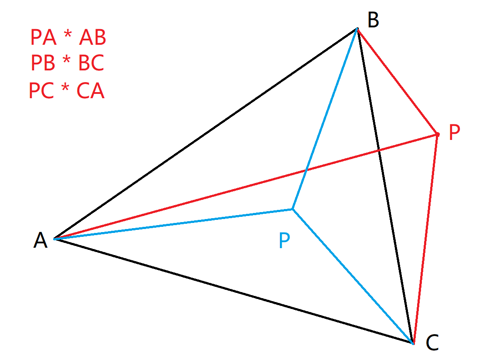

# Tiny-Renderer
不直接调用OpenGL的API，使用纯Cpp语言实现小型CPU图像渲染器

原仓库：[tinyrenderer](https://github.com/ssloy/tinyrenderer)

重新编译：
```bash
cmake --build build && ./build/MyTinyRenderer
```

# ConstructionLog-构建日志

## Day 1：像素绘制与线段光栅化

从零搭建渲染器的第一步，是解决"如何将像素写入图像"这一最基础的问题。项目直接复用了 tinyrenderer 中的 [TGAImage](https://haqr.eu/tinyrenderer/#the-starting-point) 类，作为轻量级的图像缓冲区与 `.tga` 格式输出工具——这一阶段的关注点并非图像文件格式本身，而是手动实现像素级的绘制逻辑，为后续渲染管线铺路。

在此基础上，实现了经典的 [Bresenham 线段绘制算法](https://haqr.eu/tinyrenderer/bresenham/)，完成了直线段的光栅化。这是光栅化渲染器的第一个可见成果：无需任何图形 API，仅凭数学推导就能在屏幕上画出一条直线。

## Day 2：OBJ 模型导入与线框绘制

有了线段绘制能力后，下一步是将三维几何数据引入管线。这一阶段手动实现了一个简易的 OBJ 文件解析器，能够读取 `.obj` 格式的模型文件，提取顶点坐标与面索引信息。随后结合透视投影与 Bresenham 线段绘制，将模型的三角面以线框（wireframe）形式渲染到屏幕上，首次完成了从三维数据到二维图像端到端的完整流程。

## Day 3：三角形光栅化与背面剔除

有了 Bresenham 线段绘制能力，下一步是将三角形的内部区域进行填充，形成连续的实体表面——这一步即为光栅化（Rasterization）。

核心思路：对屏幕上的每个三角形，计算其包围盒（Bounding Box），然后遍历包围盒中的每个像素，通过**二维向量叉乘**判断该像素是否在三角形内部。若三个边向量与待测点构成的叉乘结果同号（全≥0 或全≤0），则该像素在三角形内，应当着色；否则在三角形外，跳过。

<div align="center">
  
</div>

这种同号判定同时隐含了背面剔除：三角形顶点按不同缠绕顺序（CW 或 CCW）投影到屏幕时，仅朝向相机的一面通过判定，背对相机的一面自然被丢弃。为直观区分不同三角面，Day3 为每个三角形随机分配颜色（使用 `std::mt19937` 随机数引擎）。

至此，项目已实现了一条完整的 CPU 光栅化管线：`OBJ 解析 → 顶点坐标 → 视口变换 → 包围盒 → 叉乘判定 → 像素填充 → 图像输出`。

