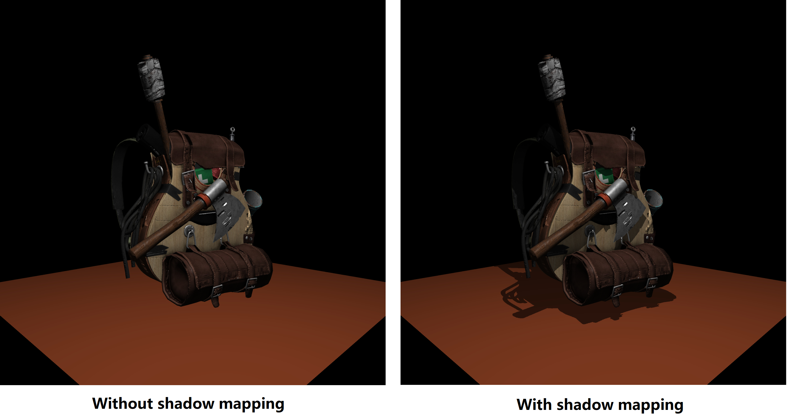
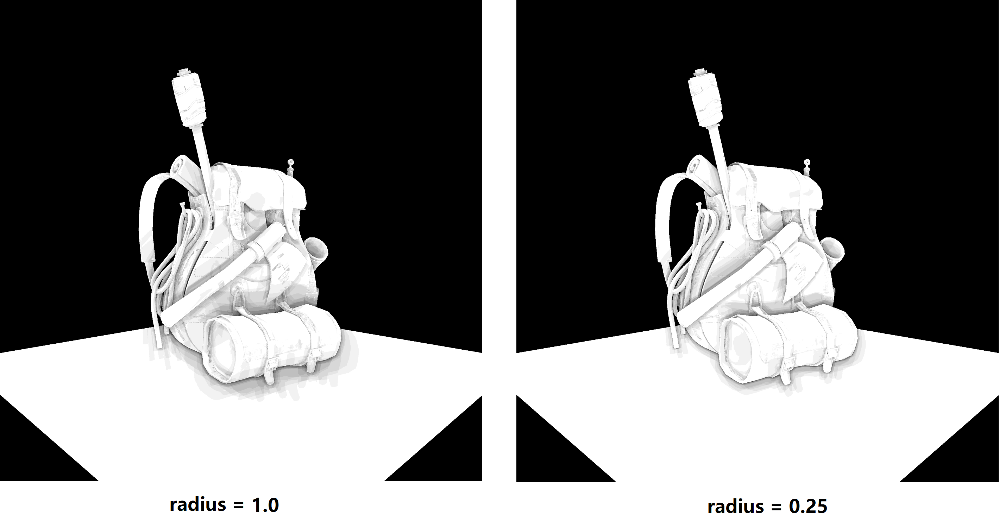
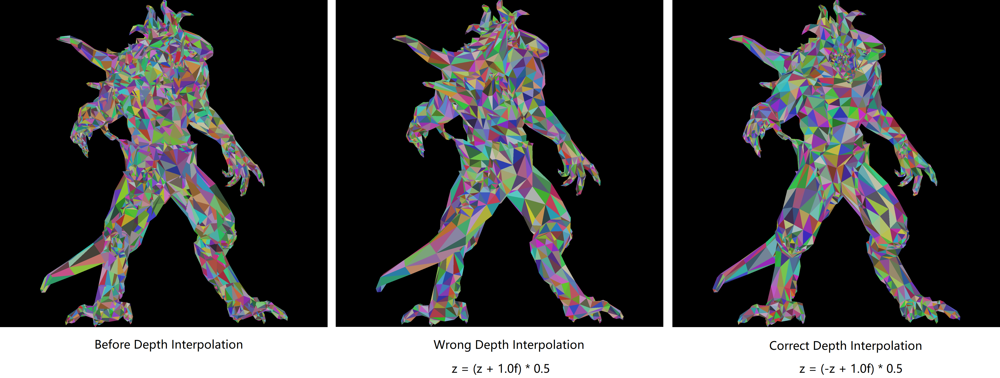
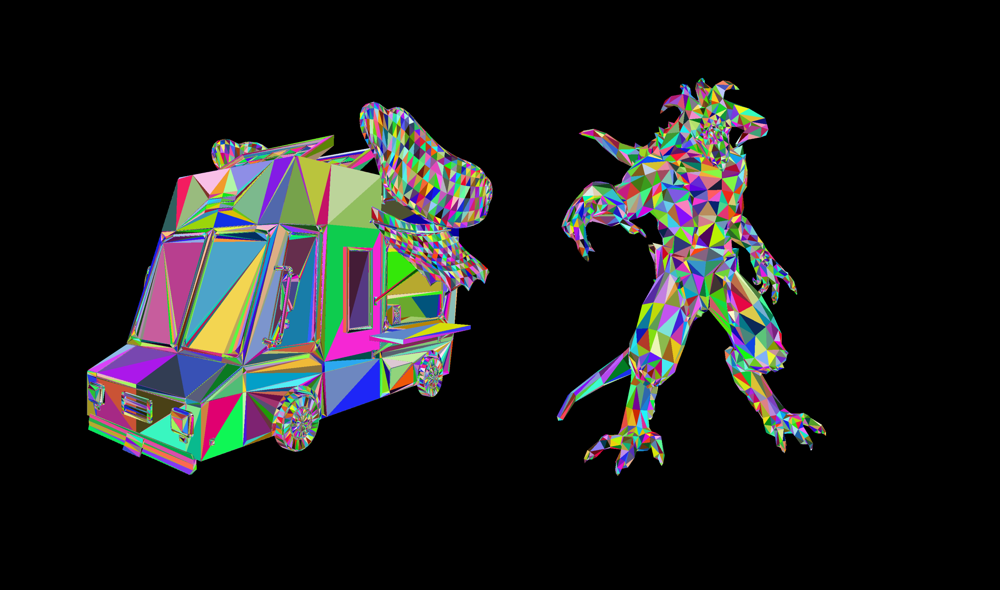
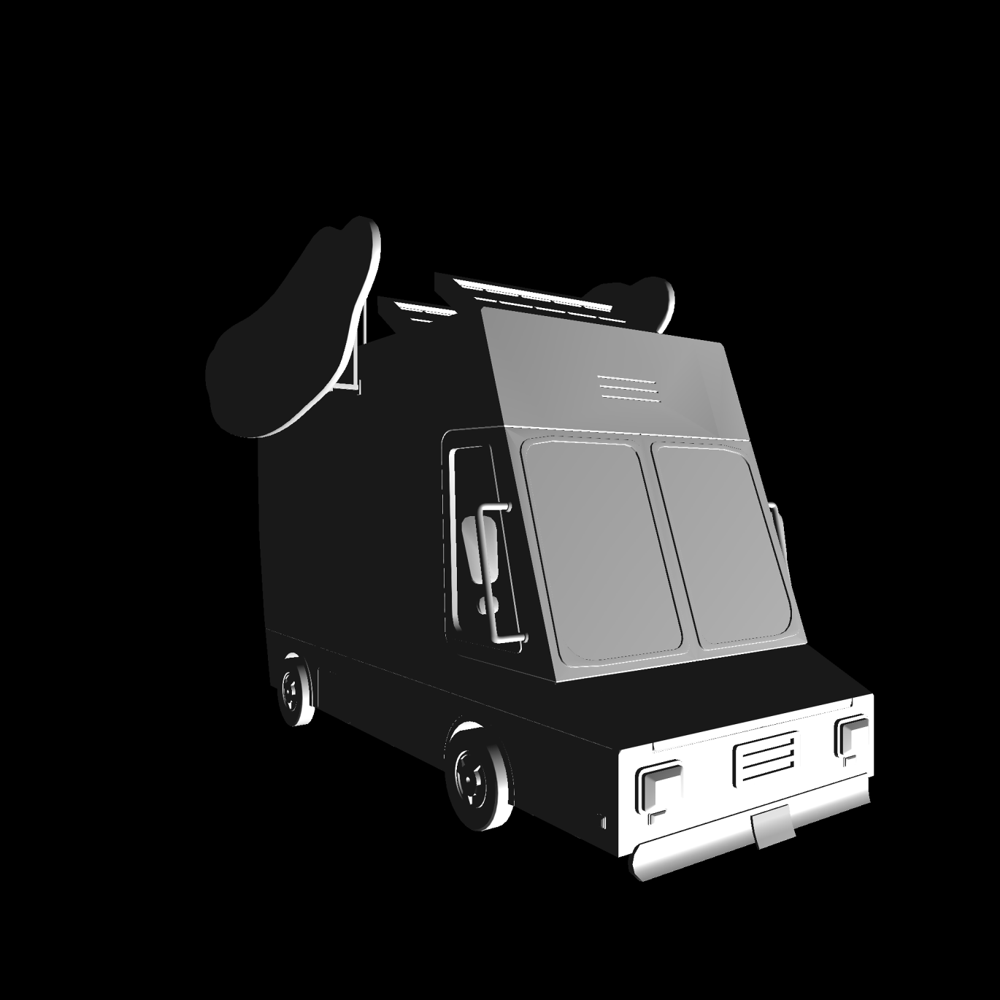
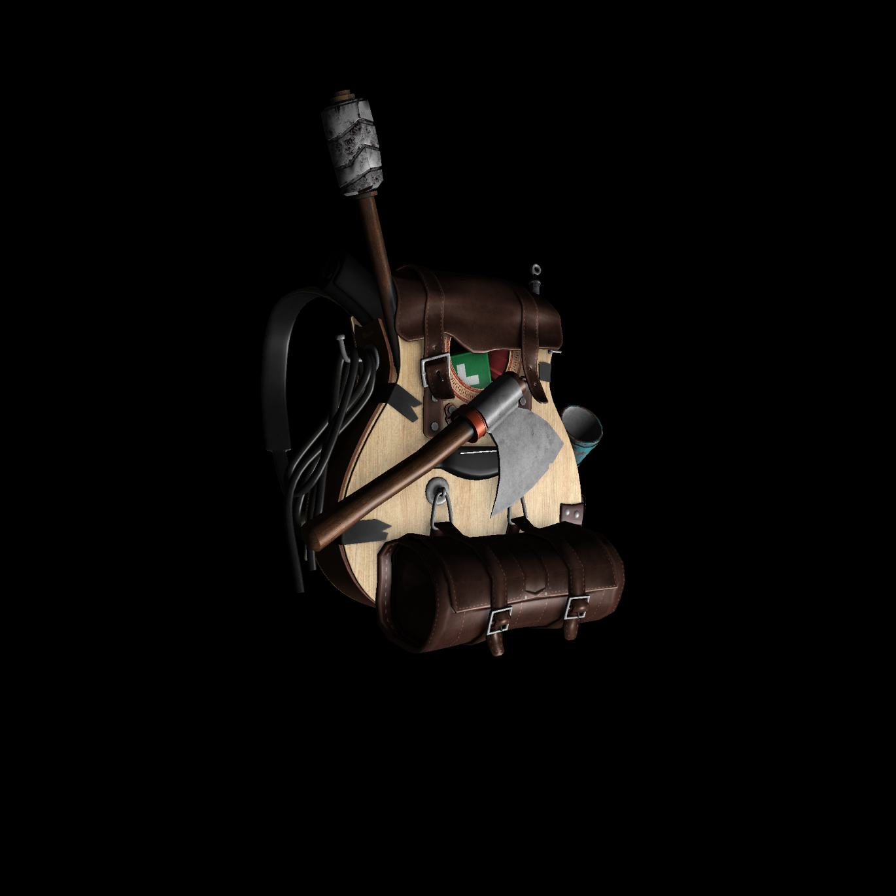
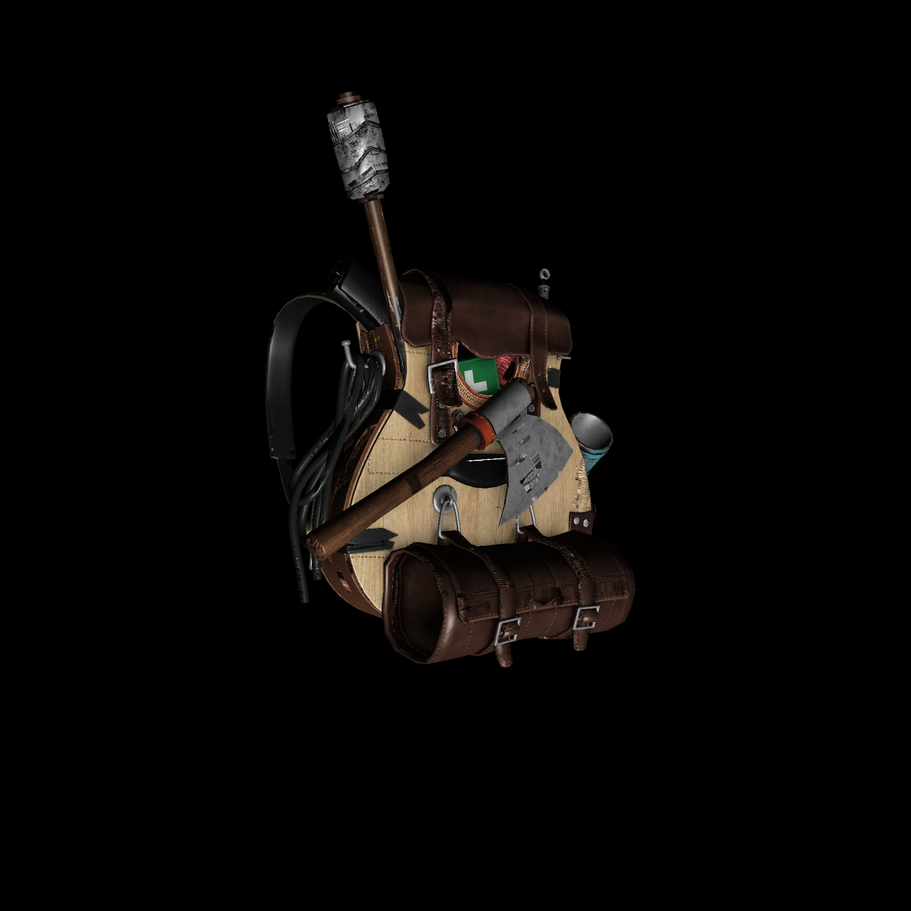
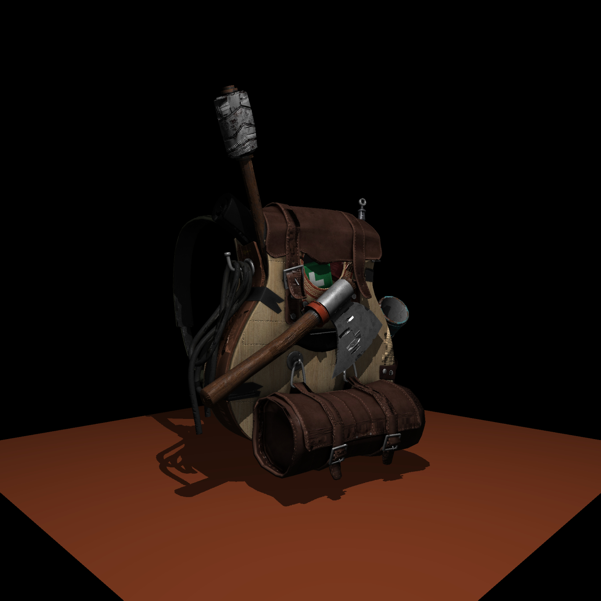
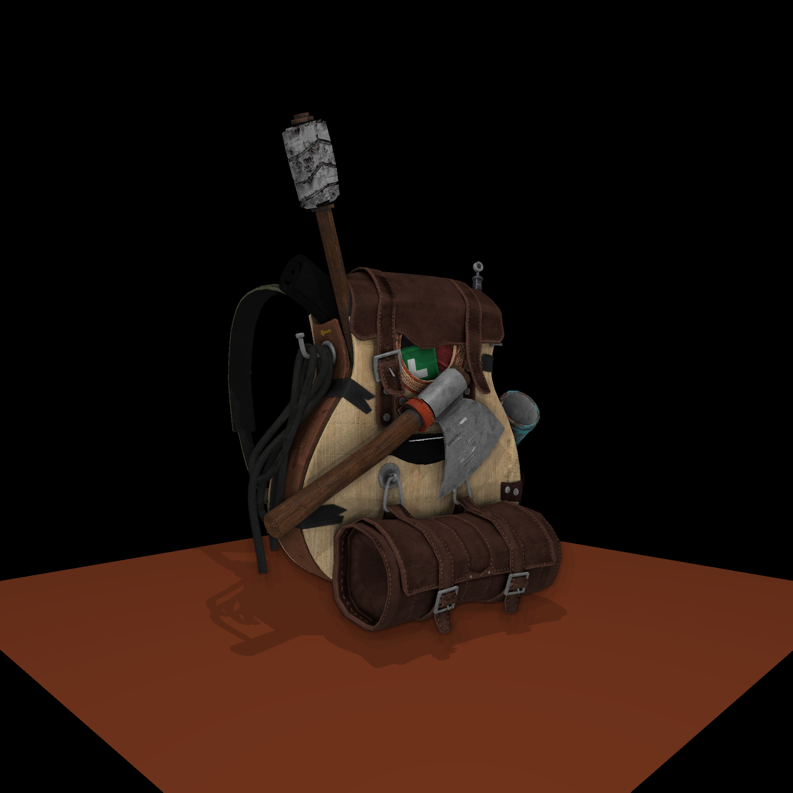

# Tiny Renderer

> 期末复习暂缓开发……orz

一个使用 **C++ 手写实现的 CPU 软件光栅渲染器**。

本项目参考 [tinyrenderer](https://github.com/ssloy/tinyrenderer) 的学习路径，从最基础的像素绘制开始，逐步实现 OBJ 模型加载、三角形光栅化、Z-Buffer、MVP 坐标变换、Shader 抽象、Blinn-Phong 光照、纹理映射与法线贴图。

项目目标不是调用 OpenGL / Vulkan / DirectX 等图形 API 完成渲染，而是手动实现一条接近真实 GPU 工作方式的渲染管线，从底层理解实时渲染的核心机制。

---

## 01｜Project Overview

Tiny Renderer 是一个面向图形学学习与底层渲染原理理解的软光栅项目。

它目前已经实现了一条完整的基础渲染管线（含三 Pass SSAO + 阴影映射）：

```text
┌─ Pass 1: Shadow Pass (Light-Space Rendering) ────────────────────┐
│ OBJ Model → Vertex Shader (ShadowDepthCalcShader)                │
│   → Light MVP → Depth Buffer → light_zbuffer                     │
└──────────────────────────────┬───────────────────────────────────┘
                               │
┌─ Pass 2: Camera Depth Pre-Pass ──────────────────────────────────┐
│ OBJ Model → Vertex Shader (ShadowDepthCalcShader)                │
│   → Camera MVP → Depth Buffer → camera_zbuffer (for SSAO lookup) │
└──────────────────────────────┬───────────────────────────────────┘
                               │
┌─ Pass 3: Camera Final Pass ──────────────────────────────────────┐
│ OBJ Model → Vertex Shader (Shadow_Blinn_PhongShader)             │
│   → MVP Transformation → Perspective Division                    │
│   → Viewport Mapping → Triangle Rasterization                    │
│   → Barycentric Interpolation                                    │
│   → Query light_zbuffer (Shadow Test)                            │
│   → Query camera_zbuffer (SSAO — Screen Space Ambient Occlusion) │
│   → Fragment Shader (Blinn-Phong + Light Attenuation)            │
│   → Depth Buffer Test → TGA Framebuffer Output                   │
└──────────────────────────────────────────────────────────────────┘
```

相比直接使用 OpenGL，本项目更关注：

- 三维模型数据如何被解析
- 顶点如何经过坐标变换进入屏幕空间
- 三角形如何被光栅化成像素
- 深度测试如何解决遮挡关系
- 光照与纹理如何在 Fragment 阶段参与计算
- 法线贴图如何在不增加几何复杂度的情况下增强表面细节
- 阴影映射如何通过两 Pass 深度比较判定遮挡关系
- 屏幕空间环境光遮蔽（SSAO）如何在单张深度图的基础上近似全局光照的遮蔽效应

---

## 02｜Features

当前项目支持：

- 轻量级 TGA 图像输出
- Bresenham 线段绘制
- OBJ 模型解析
- Wireframe 线框渲染
- 三角形填充光栅化
- 背面剔除
- 重心坐标插值
- Z-Buffer 深度测试
- Model / View / Projection / Viewport 坐标变换
- GPU 风格的 Shader 抽象
- Blinn-Phong 光照模型
- Diffuse 纹理映射
- Normal Mapping 法线贴图
- TBN 切线空间构建
- 透视矫正插值
- Shadow Mapping 阴影映射
- 屏幕空间环境光遮蔽（SSAO）
- 点光源光照衰减
- Alpha-Testing 透明裁剪
- Specular Map 高光贴图

---

## 03｜Tech Stack

| Category | Details |
| --- | --- |
| Language | C++17 |
| Build System | CMake |
| Rendering Type | CPU Software Rasterization |
| Image Output | TGA |
| Model Format | OBJ |
| Core Concepts | Rasterization, Barycentric Coordinates, Z-Buffer, MVP, Shader Pipeline |
| Shading | Flat Shading, Blinn-Phong, Texture Mapping, Normal Mapping, Shadow Mapping, SSAO, Attenuation |

---

## 04｜Core Rendering Architecture

项目逐步从简单绘制程序重构为类似 GPU 的渲染架构。

核心接口是 `IShader`：

```cpp
class IShader {
public:
    virtual vec4f vertex(int faceIndex, int vertexIndex) = 0;
    virtual std::pair<bool, TGAColor> fragment(const vec3f& bary) const = 0;
    virtual ~IShader() = default;
};
```

其中：

- `vertex()` 对应顶点着色阶段，负责顶点变换与属性传递
- `fragment()` 对应片段着色阶段，负责逐像素颜色计算
- `Draw()` 负责组织 Draw Call、透视除法、视口变换与光栅化
- `Rasterization()` 负责三角形覆盖判断、重心坐标计算、深度测试与片段调用

这种结构使后续添加新的渲染效果时，不需要反复修改核心光栅化逻辑，只需要实现新的 Shader 类即可。

---

## 05｜Technical Highlights

### 5.1 Software Rasterization

项目没有调用图形 API 的三角形绘制能力，而是手动实现 CPU 端三角形光栅化。

基本流程为：

1. 计算三角形在屏幕空间中的包围盒
2. 遍历包围盒内的每个像素
3. 判断像素是否落在三角形内部
4. 计算重心坐标
5. 插值深度与顶点属性
6. 进行 Z-Buffer 深度测试
7. 调用 Fragment Shader 输出颜色

这部分是整个软光栅管线的核心。

---

### 5.2 Barycentric Interpolation

项目使用重心坐标对三角形内部的属性进行插值。

插值对象包括：

- 深度值
- 世界空间位置
- 法线
- UV 坐标
- 切线方向
- 纹理采样坐标

通过重心插值，三角形内部不再只是简单的纯色填充，而是可以支持平滑光照、纹理采样和法线贴图。

---

### 5.3 Z-Buffer

早期随机颜色填充阶段，三角形之间没有正确的前后遮挡关系。

引入 Z-Buffer 后，每个像素都会维护当前已经绘制过的最近深度值。只有新的 Fragment 更靠近相机时，才会更新 framebuffer。

这一步实现了基本的隐藏面消除，使模型具备正确的空间遮挡关系。

---

### 5.4 MVP Transformation

项目实现了完整的坐标变换链路：

```text
Model Space → World Space → View Space → Clip Space → NDC → Screen Space
```

对应的核心矩阵包括：

| Matrix | Function |
| --- | --- |
| Model | 将模型从局部空间放置到世界空间 |
| View | 将世界空间转换到相机观察空间 |
| Projection | 将观察空间投影到裁剪空间 |
| Viewport | 将 NDC 坐标映射到屏幕像素坐标 |

这使项目从简单的 2D 绘制程序，转变为真正的 3D 渲染器。

---

### 5.5 Shader Abstraction

在重构前，顶点变换、颜色计算和绘制逻辑混杂在一起。

引入 Shader 抽象后，项目结构更接近真实 GPU 管线：

```text
Draw Call
   ↓
Vertex Shader
   ↓
Rasterization
   ↓
Fragment Shader
   ↓
Framebuffer
```

目前已经实现的 Shader 包括：

- `FlatShader` — 随机颜色填充
- `Blinn_PhongShader` — 支持 Diffuse / Normal / Specular 贴图 + Blinn-Phong 光照 + 透视矫正插值
- `ShadowDepthCalcShader` — 光源视角深度采集（Shadow Pass / Depth Pre-Pass）
- `Shadow_Blinn_PhongShader` — 继承 Blinn-Phong，增加阴影查询 + SSAO + 光照衰减

每种 Shader 都实现了 `IShader` 接口的 `vertex()` 和 `fragment()` 方法，由 `Draw()` 函数统一驱动。

这种设计让后续扩展 Gouraud Shading、Shadow Mapping、PBR 等效果更自然。

---

### 5.6 Blinn-Phong Lighting

项目实现了基础 Blinn-Phong 光照模型，包括：

- Ambient 环境光
- Diffuse 漫反射
- Specular 镜面高光

光照计算在世界空间中完成。Vertex 阶段传出世界空间位置和法线，Fragment 阶段通过重心坐标插值后进行逐像素光照计算。

相比 Flat Shading，Blinn-Phong 能够呈现更加连续、立体的明暗变化。

---

### 5.7 Texture Mapping

在固定 base color 的基础上，项目进一步加入了 Diffuse Texture 采样。

数据流为：

```text
OBJ vt
   ↓
Vertex UV
   ↓
Barycentric Interpolation
   ↓
Texture Sampling
   ↓
Base Color
   ↓
Lighting
```

纹理映射让模型不再依赖单一颜色，而是能够呈现真实材质细节。

---

### 5.8 Normal Mapping

法线贴图用于在不增加模型几何面数的情况下，模拟更加丰富的表面凹凸细节。

项目通过 TBN 切线空间将法线贴图中的局部法线转换到世界空间，再参与 Blinn-Phong 光照计算。

核心流程为：

```text
Normal Map RGB
   ↓
Tangent-space Normal
   ↓
TBN Transformation
   ↓
World-space Normal
   ↓
Blinn-Phong Lighting
```

法线贴图不会改变模型真实轮廓，但可以显著提升光照细节，使低模表面呈现更接近高模的视觉效果。

---

### 5.9 Perspective-Correct Interpolation

在透视投影后，屏幕空间中的线性插值并不等价于三维空间中的真实线性插值。

因此项目对 UV、法线、世界坐标等属性引入透视矫正插值，避免纹理和法线在透视视角下产生错误变形。

这是从”能跑起来的软光栅”走向”更接近真实渲染管线”的关键一步。

---

### 5.10 Shadow Mapping

项目实现了基础 Shadow Mapping——通过两 Pass 渲染在场景中产生阴影：

**Pass 1 — Shadow Pass**：从点光源视角渲染场景，使用 `ShadowDepthCalcShader` 将深度信息写入独立的 `light_zbuffer`。

**Pass 2 — Camera Pass**：从观察者视角正常渲染，`Shadow_Blinn_PhongShader` 将每个片段的世界空间坐标变换到光源屏幕空间，在 `light_zbuffer` 中查询深度，判定该片段是否处于阴影中。

核心思路是利用世界空间坐标作为两个 Pass 之间的桥梁——不计算逆矩阵，而是正向走两条 MVP 变换链：

```text
世界空间 frag_WorldPos
        │
   ┌────┴────┐
   │         │
Camera MVP  Light MVP
   │         │
   ▼         ▼
渲染画面   查 Shadow Map → Shadow Factor
```

同时，光照计算引入了随距离的二次衰减（Attenuation），使远离光源的表面自然变暗。Shadow Factor 只削弱漫反射与镜面反射分量，环境光不受影响——保证阴影区域不会完全漆黑。

<div align="center">
  
</div>

---

### 5.11 Screen Space Ambient Occlusion (SSAO)

SSAO 通过分析屏幕空间中每个像素周围的几何分布，估算该点的环境光遮蔽程度——使角落、缝隙和物体接触边缘呈现出自然的暗部过渡。

核心思路：在观察空间中，对每个片段沿其法线方向的上半球随机生成采样点，将采样点投影回屏幕空间，与 Camera Depth Buffer 中该位置的深度做比较，统计被周围几何体遮挡的比例作为 AO 因子。

实现要点：

- **三 Pass 架构**：Camera Depth Pre-Pass 生成相机视角深度缓冲（`camera_zbuffer`），供 SSAO 在 Final Pass 中查询；
- **随机采样核**：预生成 20 个落在法线半球方向上的随机采样点，以二次衰减分布使更多采样点聚集在靠近片元的位置；
- **观察空间 TBN**：以片段观察空间法线为 Z 轴构建正交基，将采样核旋转到正确的法线方向；
- **NDC 空间深度比较**：将屏幕空间深度反算回 NDC 做遮挡判定，比直接在 screen.z 空间比较具有更均匀的精度分布。

最终 AO 因子乘在环境光分量上：被周围几何体包围的区域变暗、暴露在外的表面保持原有亮度——使环境光从「全局常数」进化为逐像素遮蔽量。

<div align="center">
  
</div>

---

## 06｜Development Progress

| Stage | Topic | Main Result |
| --- | --- | --- |
| Day 1 | Pixel Drawing & Line Rasterization | 实现 TGA 图像输出与 Bresenham 线段绘制 |
| Day 2 | OBJ Loading & Wireframe Rendering | 解析 OBJ 顶点和面数据，完成线框模型渲染 |
| Day 3 | Triangle Rasterization | 实现三角形填充、包围盒遍历与背面剔除 |
| Day 4 | Barycentric Coordinates & Z-Buffer | 实现重心插值与深度缓冲，解决遮挡关系 |
| Day 5 | MVP & Viewport Transformation | 完成模型空间到屏幕空间的完整坐标变换 |
| Day 6 | Shader Refactoring | 引入 `IShader`，重构为类 GPU 渲染管线 |
| Day 7 | Blinn-Phong Lighting | 实现环境光、漫反射和镜面高光 |
| Day 8 | Texture Mapping | 支持 Diffuse 纹理采样与材质颜色 |
| Day 9 | Normal Mapping | 实现 TBN 切线空间与法线贴图光照细节 |
| Day 10 | Shadow Mapping | 实现 Shadow Map 两 Pass 阴影渲染 + 光照衰减 |
| Day 11 | Screen Space AO | 实现 SSAO — 屏幕空间环境光遮蔽 + 三 Pass 架构 |

---

## 07｜Gallery

### Rasterization & Z-Buffer

<div align="center">
  
</div>

### MVP Transformation

<div align="center">
  
</div>

### Blinn-Phong Lighting

<div align="center">
  
</div>

### Texture Mapping

<div align="center">
  
</div>

### Normal Mapping

<div align="center">
  
</div>

### Shadow Mapping

<div align="center">
  
</div>

### Screen Space Ambient Occlusion

<div align="center">
  
</div>

---

## 08｜Build & Run

### Build

```bash
cmake --build build
```

### Run

```bash
./build/MyTinyRenderer
```

或者直接执行：

```bash
cmake --build build && ./build/MyTinyRenderer
```

---

## 09｜Project Structure

```text
Tiny-Renderer/
├── CMakeLists.txt
├── ConstructionLog.md
├── README.md
├── assets/                 # 渲染截图
├── attachments/            # 推导笔记与参考资料
├── media/                  # 模型与纹理资源
│   ├── Backpack/
│   ├── OldHouse/
│   ├── Plane/
│   └── diablo3_pose.obj
├── geometry.h              # 向量、矩阵数学库
├── main.cpp                # 入口：场景配置 + MVP + Draw Call
├── rendering.cpp/h         # 光栅化与绘制主循环
├── shader.cpp/h            # IShader 接口 + 各 Shader 实现
├── shader-archived.h       # 旧版 Shader 开发存档
├── tgaimage.cpp/h          # TGA 图像读写
├── tinyobjloader.cpp/h     # OBJ 模型解析
└── transformation.cpp/h    # MVP 变换矩阵
```

## 10｜References

- [tinyrenderer](https://github.com/ssloy/tinyrenderer)
- [tinyrenderer tutorial](https://haqr.eu/tinyrenderer/)
- [LearnOpenGL](https://learnopengl.com/)
